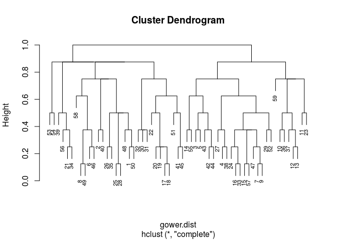
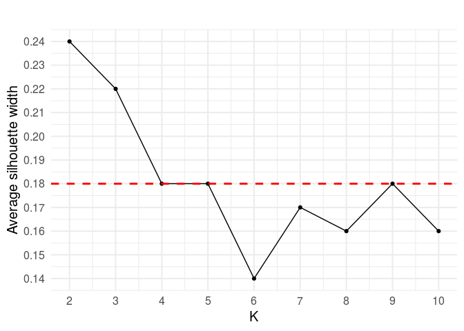
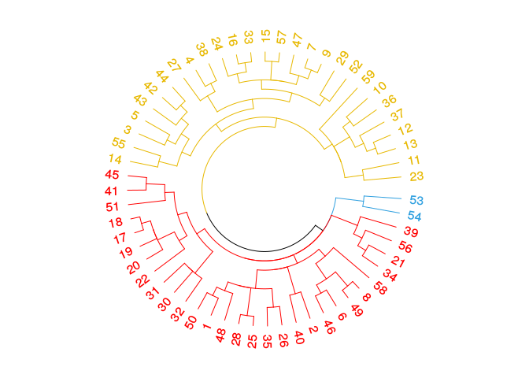
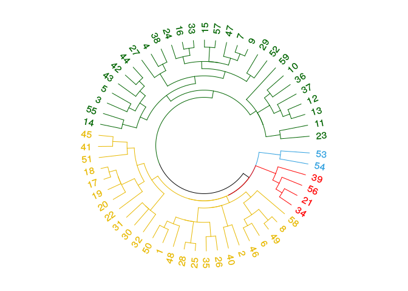
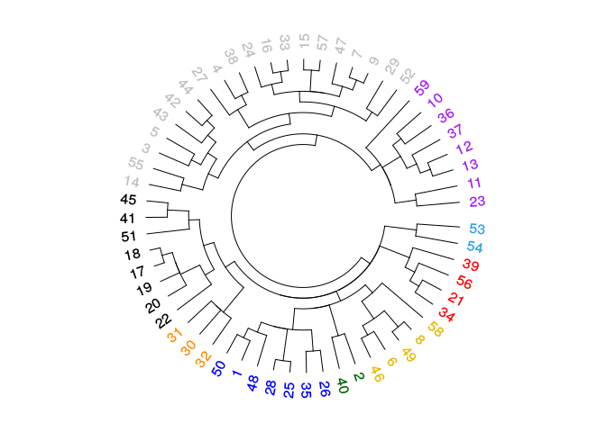

# Dataset


```r
kable(dataset) %>%
  kable_styling(bootstrap_options = c("striped", "hover", "condensed"))
```

<table class="table table-striped table-hover table-condensed" style="margin-left: auto; margin-right: auto;">
 <thead>
  <tr>
   <th style="text-align:right;"> ID </th>
   <th style="text-align:left;"> Title </th>
   <th style="text-align:left;"> Application Domain </th>
   <th style="text-align:left;"> Emergent Behaviour </th>
   <th style="text-align:left;"> Cooperative (agent level) </th>
   <th style="text-align:left;"> Selfishness </th>
   <th style="text-align:left;"> Autonomy </th>
   <th style="text-align:left;"> Knowledge Access </th>
   <th style="text-align:left;"> Trigger - first </th>
   <th style="text-align:left;"> Trigger - update </th>
   <th style="text-align:left;"> Technique </th>
  </tr>
 </thead>
<tbody>
  <tr>
   <td style="text-align:right;"> 1 </td>
   <td style="text-align:left;"> Pervasive Self-Learning with Multi-modal Distributed Sensors </td>
   <td style="text-align:left;"> CPS </td>
   <td style="text-align:left;"> No </td>
   <td style="text-align:left;"> Yes </td>
   <td style="text-align:left;"> Selfish but collaborative </td>
   <td style="text-align:left;"> Restricted Autonomy </td>
   <td style="text-align:left;"> Neighborhood </td>
   <td style="text-align:left;"> No initial knowledge (random) </td>
   <td style="text-align:left;"> Periodic </td>
   <td style="text-align:left;"> Probabilistic </td>
  </tr>
  <tr>
   <td style="text-align:right;"> 2 </td>
   <td style="text-align:left;"> Distributed W-Learning: Multi-Policy Optimization in Self-Organizing Systems </td>
   <td style="text-align:left;"> Traffic </td>
   <td style="text-align:left;"> No </td>
   <td style="text-align:left;"> Yes </td>
   <td style="text-align:left;"> Altruistic locally / Selfish globally </td>
   <td style="text-align:left;"> Full Autonomy </td>
   <td style="text-align:left;"> Neighborhood </td>
   <td style="text-align:left;"> No initial knowledge (random) </td>
   <td style="text-align:left;"> Not mentioned </td>
   <td style="text-align:left;"> Reinforcement Learning </td>
  </tr>
  <tr>
   <td style="text-align:right;"> 3 </td>
   <td style="text-align:left;"> Self-organized Fault-tolerant Routing in Peer-to-Peer Overlays </td>
   <td style="text-align:left;"> Network </td>
   <td style="text-align:left;"> Yes </td>
   <td style="text-align:left;"> No </td>
   <td style="text-align:left;"> Selfish </td>
   <td style="text-align:left;"> Full Autonomy </td>
   <td style="text-align:left;"> Minimal </td>
   <td style="text-align:left;"> From peers and other agents </td>
   <td style="text-align:left;"> Periodic </td>
   <td style="text-align:left;"> Reinforcement Learning </td>
  </tr>
  <tr>
   <td style="text-align:right;"> 4 </td>
   <td style="text-align:left;"> Self-organizing Bandwidth Sharing in Priority-Based Medium Access </td>
   <td style="text-align:left;"> Network </td>
   <td style="text-align:left;"> Yes </td>
   <td style="text-align:left;"> No </td>
   <td style="text-align:left;"> Selfish </td>
   <td style="text-align:left;"> Full Autonomy </td>
   <td style="text-align:left;"> Limited </td>
   <td style="text-align:left;"> No initial knowledge (random) </td>
   <td style="text-align:left;"> Action </td>
   <td style="text-align:left;"> Game Theory </td>
  </tr>
  <tr>
   <td style="text-align:right;"> 5 </td>
   <td style="text-align:left;"> Incremental Social Learning Applied to a Decentralized Decision-Making Mechanism: Collective Learning Made Faster </td>
   <td style="text-align:left;"> Other </td>
   <td style="text-align:left;"> Yes </td>
   <td style="text-align:left;"> No </td>
   <td style="text-align:left;"> Selfish </td>
   <td style="text-align:left;"> Full Autonomy </td>
   <td style="text-align:left;"> Minimal </td>
   <td style="text-align:left;"> From peers and other agents </td>
   <td style="text-align:left;"> Not mentioned </td>
   <td style="text-align:left;"> Statistics </td>
  </tr>
  <tr>
   <td style="text-align:right;"> 6 </td>
   <td style="text-align:left;"> Simulating Human Single Motor Units Using Self-Organizing Agents </td>
   <td style="text-align:left;"> Other </td>
   <td style="text-align:left;"> No </td>
   <td style="text-align:left;"> Yes </td>
   <td style="text-align:left;"> Altruistic </td>
   <td style="text-align:left;"> Full Autonomy </td>
   <td style="text-align:left;"> Limited </td>
   <td style="text-align:left;"> No initial knowledge (random) </td>
   <td style="text-align:left;"> Periodic </td>
   <td style="text-align:left;"> Evolutionary Process </td>
  </tr>
  <tr>
   <td style="text-align:right;"> 7 </td>
   <td style="text-align:left;"> Learning to be Different: Heterogeneity and Efficiency in Distributed Smart Camera Networks </td>
   <td style="text-align:left;"> CPS </td>
   <td style="text-align:left;"> Yes </td>
   <td style="text-align:left;"> No </td>
   <td style="text-align:left;"> Selfish </td>
   <td style="text-align:left;"> Full Autonomy </td>
   <td style="text-align:left;"> Maximal </td>
   <td style="text-align:left;"> No initial knowledge (random) </td>
   <td style="text-align:left;"> Periodic </td>
   <td style="text-align:left;"> Reinforcement Learning </td>
  </tr>
  <tr>
   <td style="text-align:right;"> 8 </td>
   <td style="text-align:left;"> Self-Organizational Reciprocal Agents for Conflict Avoidance in Allocation Problems </td>
   <td style="text-align:left;"> Other </td>
   <td style="text-align:left;"> No </td>
   <td style="text-align:left;"> Yes </td>
   <td style="text-align:left;"> Selfish but collaborative </td>
   <td style="text-align:left;"> Full Autonomy </td>
   <td style="text-align:left;"> Limited </td>
   <td style="text-align:left;"> No initial knowledge (random) </td>
   <td style="text-align:left;"> Periodic </td>
   <td style="text-align:left;"> Reinforcement Learning </td>
  </tr>
  <tr>
   <td style="text-align:right;"> 9 </td>
   <td style="text-align:left;"> A Mutual Influence Detection Algorithm for Systems with Local Performance Measurement </td>
   <td style="text-align:left;"> CPS </td>
   <td style="text-align:left;"> Yes </td>
   <td style="text-align:left;"> No </td>
   <td style="text-align:left;"> Selfish </td>
   <td style="text-align:left;"> Full Autonomy </td>
   <td style="text-align:left;"> Neighborhood </td>
   <td style="text-align:left;"> No initial knowledge (random) </td>
   <td style="text-align:left;"> Periodic </td>
   <td style="text-align:left;"> Reinforcement Learning </td>
  </tr>
  <tr>
   <td style="text-align:right;"> 10 </td>
   <td style="text-align:left;"> Towards Dynamic Epistemic Learning of Actions in Autonomic Multi-agent Systems </td>
   <td style="text-align:left;"> Other </td>
   <td style="text-align:left;"> No </td>
   <td style="text-align:left;"> No </td>
   <td style="text-align:left;"> Selfish </td>
   <td style="text-align:left;"> Full Autonomy </td>
   <td style="text-align:left;"> Maximal </td>
   <td style="text-align:left;"> No initial knowledge (random) </td>
   <td style="text-align:left;"> Task/Episode </td>
   <td style="text-align:left;"> Applied Logic </td>
  </tr>
  <tr>
   <td style="text-align:right;"> 11 </td>
   <td style="text-align:left;"> Cooperative Resource Allocation in Open Systems of Systems </td>
   <td style="text-align:left;"> CPS </td>
   <td style="text-align:left;"> No </td>
   <td style="text-align:left;"> No </td>
   <td style="text-align:left;"> Both versions explored </td>
   <td style="text-align:left;"> Full Autonomy </td>
   <td style="text-align:left;"> Tunable </td>
   <td style="text-align:left;"> Domain knowledge / humans </td>
   <td style="text-align:left;"> Learning task threshold achieved </td>
   <td style="text-align:left;"> Supervised Learning </td>
  </tr>
  <tr>
   <td style="text-align:right;"> 12 </td>
   <td style="text-align:left;"> Multiagent Reinforcement Social Learning Toward Coordination in Cooperative Multiagent Systems </td>
   <td style="text-align:left;"> Cooperative Game </td>
   <td style="text-align:left;"> No </td>
   <td style="text-align:left;"> No </td>
   <td style="text-align:left;"> Both versions explored </td>
   <td style="text-align:left;"> Full Autonomy </td>
   <td style="text-align:left;"> Neighborhood </td>
   <td style="text-align:left;"> No initial knowledge (random) </td>
   <td style="text-align:left;"> Task/Episode </td>
   <td style="text-align:left;"> Reinforcement Learning </td>
  </tr>
  <tr>
   <td style="text-align:right;"> 13 </td>
   <td style="text-align:left;"> Efficient and Robust Emergence of Norms Through Heuristic Collective Learning </td>
   <td style="text-align:left;"> Cooperative Game </td>
   <td style="text-align:left;"> No </td>
   <td style="text-align:left;"> No </td>
   <td style="text-align:left;"> Altruistic </td>
   <td style="text-align:left;"> Full Autonomy </td>
   <td style="text-align:left;"> Neighborhood </td>
   <td style="text-align:left;"> No initial knowledge (random) </td>
   <td style="text-align:left;"> Task/Episode </td>
   <td style="text-align:left;"> Game Theory </td>
  </tr>
  <tr>
   <td style="text-align:right;"> 14 </td>
   <td style="text-align:left;"> Reinforcement Learning of Informed Initial Policies for Decentralized Planning </td>
   <td style="text-align:left;"> CPS </td>
   <td style="text-align:left;"> No </td>
   <td style="text-align:left;"> No </td>
   <td style="text-align:left;"> Selfish </td>
   <td style="text-align:left;"> Full Autonomy </td>
   <td style="text-align:left;"> Minimal </td>
   <td style="text-align:left;"> From peers and other agents </td>
   <td style="text-align:left;"> Learning task threshold achieved </td>
   <td style="text-align:left;"> Reinforcement Learning </td>
  </tr>
  <tr>
   <td style="text-align:right;"> 15 </td>
   <td style="text-align:left;"> Prediction-Based Multi-Agent Reinforcement Learning in Inherently Non-Stationary Environments </td>
   <td style="text-align:left;"> CPS </td>
   <td style="text-align:left;"> Yes </td>
   <td style="text-align:left;"> No </td>
   <td style="text-align:left;"> Selfish </td>
   <td style="text-align:left;"> Full Autonomy </td>
   <td style="text-align:left;"> Minimal </td>
   <td style="text-align:left;"> Domain knowledge / humans </td>
   <td style="text-align:left;"> Periodic </td>
   <td style="text-align:left;"> Reinforcement Learning </td>
  </tr>
  <tr>
   <td style="text-align:right;"> 16 </td>
   <td style="text-align:left;"> A Reinforcement Learning Approach for Interdomain Routing with Link Prices </td>
   <td style="text-align:left;"> Network </td>
   <td style="text-align:left;"> Yes </td>
   <td style="text-align:left;"> No </td>
   <td style="text-align:left;"> Selfish </td>
   <td style="text-align:left;"> Full Autonomy </td>
   <td style="text-align:left;"> Minimal </td>
   <td style="text-align:left;"> No initial knowledge (random) </td>
   <td style="text-align:left;"> Action </td>
   <td style="text-align:left;"> Reinforcement Learning </td>
  </tr>
  <tr>
   <td style="text-align:right;"> 17 </td>
   <td style="text-align:left;"> Machine Learning in Disruption-tolerant MANETs </td>
   <td style="text-align:left;"> Network </td>
   <td style="text-align:left;"> No </td>
   <td style="text-align:left;"> Yes </td>
   <td style="text-align:left;"> Altruistic (collaborative) </td>
   <td style="text-align:left;"> Full Autonomy </td>
   <td style="text-align:left;"> Neighborhood </td>
   <td style="text-align:left;"> No initial knowledge (random) </td>
   <td style="text-align:left;"> Social interaction </td>
   <td style="text-align:left;"> Probabilistic </td>
  </tr>
  <tr>
   <td style="text-align:right;"> 18 </td>
   <td style="text-align:left;"> Mobilized ad-hoc networks: a reinforcement learning approach </td>
   <td style="text-align:left;"> Network </td>
   <td style="text-align:left;"> No </td>
   <td style="text-align:left;"> Yes </td>
   <td style="text-align:left;"> Altruistic (collaborative) </td>
   <td style="text-align:left;"> Full Autonomy </td>
   <td style="text-align:left;"> Neighborhood </td>
   <td style="text-align:left;"> No initial knowledge (random) </td>
   <td style="text-align:left;"> Social interaction </td>
   <td style="text-align:left;"> Reinforcement Learning </td>
  </tr>
  <tr>
   <td style="text-align:right;"> 19 </td>
   <td style="text-align:left;"> Autonomous smart routing for network QoS </td>
   <td style="text-align:left;"> Network </td>
   <td style="text-align:left;"> No </td>
   <td style="text-align:left;"> Yes </td>
   <td style="text-align:left;"> Altruistic (collaborative) </td>
   <td style="text-align:left;"> Full Autonomy </td>
   <td style="text-align:left;"> Neighborhood </td>
   <td style="text-align:left;"> No initial knowledge (random) </td>
   <td style="text-align:left;"> Action </td>
   <td style="text-align:left;"> Reinforcement Learning </td>
  </tr>
  <tr>
   <td style="text-align:right;"> 20 </td>
   <td style="text-align:left;"> Decentralized Bayesian Reinforcement Learning for Online Agent Collaboration </td>
   <td style="text-align:left;"> CPS </td>
   <td style="text-align:left;"> No </td>
   <td style="text-align:left;"> Yes </td>
   <td style="text-align:left;"> Altruistic (collaborative) </td>
   <td style="text-align:left;"> Full Autonomy </td>
   <td style="text-align:left;"> Neighborhood </td>
   <td style="text-align:left;"> No initial knowledge (random) </td>
   <td style="text-align:left;"> Social interaction </td>
   <td style="text-align:left;"> Reinforcement Learning </td>
  </tr>
  <tr>
   <td style="text-align:right;"> 21 </td>
   <td style="text-align:left;"> Modeling Assistant s Autonomy Constraints As a Means for Improving Autonomous Assistant-Agent Design </td>
   <td style="text-align:left;"> Market </td>
   <td style="text-align:left;"> No </td>
   <td style="text-align:left;"> Yes </td>
   <td style="text-align:left;"> Selfish </td>
   <td style="text-align:left;"> Full Autonomy </td>
   <td style="text-align:left;"> Minimal </td>
   <td style="text-align:left;"> Not mentioned </td>
   <td style="text-align:left;"> Action </td>
   <td style="text-align:left;"> Supervised Learning </td>
  </tr>
  <tr>
   <td style="text-align:right;"> 22 </td>
   <td style="text-align:left;"> Adaptivity at Every Layer: A Modular Approach for Evolving Societies of Learning Autonomous Systems </td>
   <td style="text-align:left;"> CPS </td>
   <td style="text-align:left;"> No </td>
   <td style="text-align:left;"> Yes </td>
   <td style="text-align:left;"> Altruistic (collaborative) </td>
   <td style="text-align:left;"> Full Autonomy </td>
   <td style="text-align:left;"> Minimal </td>
   <td style="text-align:left;"> Not mentioned </td>
   <td style="text-align:left;"> Social interaction </td>
   <td style="text-align:left;"> Reinforcement Learning </td>
  </tr>
  <tr>
   <td style="text-align:right;"> 23 </td>
   <td style="text-align:left;"> Bayesian Interaction Shaping: Learning to Influence Strategic Interactions in Mixed Robotic Domains </td>
   <td style="text-align:left;"> CPS </td>
   <td style="text-align:left;"> No </td>
   <td style="text-align:left;"> No </td>
   <td style="text-align:left;"> Altruistic locally / Selfish globally </td>
   <td style="text-align:left;"> Full Autonomy </td>
   <td style="text-align:left;"> Limited </td>
   <td style="text-align:left;"> Domain knowledge / humans </td>
   <td style="text-align:left;"> Action </td>
   <td style="text-align:left;"> Probabilistic </td>
  </tr>
  <tr>
   <td style="text-align:right;"> 24 </td>
   <td style="text-align:left;"> Resource Abstraction for Reinforcement Learning in Multiagent Congestion Problems </td>
   <td style="text-align:left;"> Traffic </td>
   <td style="text-align:left;"> Yes </td>
   <td style="text-align:left;"> No </td>
   <td style="text-align:left;"> Selfish </td>
   <td style="text-align:left;"> Full Autonomy </td>
   <td style="text-align:left;"> Minimal </td>
   <td style="text-align:left;"> No initial knowledge (random) </td>
   <td style="text-align:left;"> Not mentioned </td>
   <td style="text-align:left;"> Reinforcement Learning </td>
  </tr>
  <tr>
   <td style="text-align:right;"> 25 </td>
   <td style="text-align:left;"> Multiagent Reinforcement Learning and Self-organization in a Network of Agents </td>
   <td style="text-align:left;"> Distributed Task Allocation Problem </td>
   <td style="text-align:left;"> No </td>
   <td style="text-align:left;"> Yes </td>
   <td style="text-align:left;"> Selfish but collaborative </td>
   <td style="text-align:left;"> Full Autonomy </td>
   <td style="text-align:left;"> Minimal </td>
   <td style="text-align:left;"> No initial knowledge (random) </td>
   <td style="text-align:left;"> Action </td>
   <td style="text-align:left;"> Reinforcement Learning </td>
  </tr>
  <tr>
   <td style="text-align:right;"> 26 </td>
   <td style="text-align:left;"> Batch Reinforcement Learning in a Complex Domain </td>
   <td style="text-align:left;"> CPS </td>
   <td style="text-align:left;"> No </td>
   <td style="text-align:left;"> Yes </td>
   <td style="text-align:left;"> Selfish but collaborative </td>
   <td style="text-align:left;"> Full Autonomy </td>
   <td style="text-align:left;"> Maximal </td>
   <td style="text-align:left;"> Domain knowledge / humans </td>
   <td style="text-align:left;"> Learning task threshold achieved </td>
   <td style="text-align:left;"> Reinforcement Learning </td>
  </tr>
  <tr>
   <td style="text-align:right;"> 27 </td>
   <td style="text-align:left;"> Co-evolution of Agent Strategies in N-player Dilemmas </td>
   <td style="text-align:left;"> Cooperative Game </td>
   <td style="text-align:left;"> Yes </td>
   <td style="text-align:left;"> No </td>
   <td style="text-align:left;"> Selfish </td>
   <td style="text-align:left;"> Full Autonomy </td>
   <td style="text-align:left;"> Neighborhood </td>
   <td style="text-align:left;"> No initial knowledge (random) </td>
   <td style="text-align:left;"> Learning task threshold achieved </td>
   <td style="text-align:left;"> Game Theory </td>
  </tr>
  <tr>
   <td style="text-align:right;"> 28 </td>
   <td style="text-align:left;"> Self-organisation in an Agent Network via Learning </td>
   <td style="text-align:left;"> Distributed Task Allocation Problem </td>
   <td style="text-align:left;"> No </td>
   <td style="text-align:left;"> Yes </td>
   <td style="text-align:left;"> Selfish but collaborative </td>
   <td style="text-align:left;"> Full Autonomy </td>
   <td style="text-align:left;"> Neighborhood </td>
   <td style="text-align:left;"> No initial knowledge (random) </td>
   <td style="text-align:left;"> Action </td>
   <td style="text-align:left;"> Reinforcement Learning </td>
  </tr>
  <tr>
   <td style="text-align:right;"> 29 </td>
   <td style="text-align:left;"> Self-organization for Coordinating Decentralized Reinforcement Learning </td>
   <td style="text-align:left;"> Distributed Task Allocation Problem </td>
   <td style="text-align:left;"> Yes </td>
   <td style="text-align:left;"> No </td>
   <td style="text-align:left;"> Selfish </td>
   <td style="text-align:left;"> Full Autonomy </td>
   <td style="text-align:left;"> Tunable </td>
   <td style="text-align:left;"> No initial knowledge (random) </td>
   <td style="text-align:left;"> Action </td>
   <td style="text-align:left;"> Reinforcement Learning </td>
  </tr>
  <tr>
   <td style="text-align:right;"> 30 </td>
   <td style="text-align:left;"> Adjustable Autonomy in Real-world Multi-agent Environments </td>
   <td style="text-align:left;"> Other </td>
   <td style="text-align:left;"> No </td>
   <td style="text-align:left;"> Yes </td>
   <td style="text-align:left;"> Altruistic </td>
   <td style="text-align:left;"> Restricted Autonomy </td>
   <td style="text-align:left;"> Maximal </td>
   <td style="text-align:left;"> Domain knowledge / humans </td>
   <td style="text-align:left;"> Task/Episode </td>
   <td style="text-align:left;"> Reinforcement Learning </td>
  </tr>
  <tr>
   <td style="text-align:right;"> 31 </td>
   <td style="text-align:left;"> How Autonomy Oriented Computing (AOC) Tackles a Computationally Hard Optimization Problem </td>
   <td style="text-align:left;"> Cooperative Game </td>
   <td style="text-align:left;"> No </td>
   <td style="text-align:left;"> Yes </td>
   <td style="text-align:left;"> Altruistic </td>
   <td style="text-align:left;"> Full Autonomy </td>
   <td style="text-align:left;"> Maximal </td>
   <td style="text-align:left;"> Domain knowledge / humans </td>
   <td style="text-align:left;"> Action </td>
   <td style="text-align:left;"> Game Theory </td>
  </tr>
  <tr>
   <td style="text-align:right;"> 32 </td>
   <td style="text-align:left;"> A Bartering Approach to Improve Multiagent Learning </td>
   <td style="text-align:left;"> Other </td>
   <td style="text-align:left;"> No </td>
   <td style="text-align:left;"> Yes </td>
   <td style="text-align:left;"> Selfish </td>
   <td style="text-align:left;"> Full Autonomy </td>
   <td style="text-align:left;"> Maximal </td>
   <td style="text-align:left;"> Domain knowledge / humans </td>
   <td style="text-align:left;"> Action </td>
   <td style="text-align:left;"> Supervised Learning </td>
  </tr>
  <tr>
   <td style="text-align:right;"> 33 </td>
   <td style="text-align:left;"> Learning Sequences of Actions in Collectives of Autonomous Agents </td>
   <td style="text-align:left;"> CPS </td>
   <td style="text-align:left;"> Yes </td>
   <td style="text-align:left;"> No </td>
   <td style="text-align:left;"> Selfish </td>
   <td style="text-align:left;"> Full Autonomy </td>
   <td style="text-align:left;"> Minimal </td>
   <td style="text-align:left;"> No initial knowledge (random) </td>
   <td style="text-align:left;"> Action </td>
   <td style="text-align:left;"> Reinforcement Learning </td>
  </tr>
  <tr>
   <td style="text-align:right;"> 34 </td>
   <td style="text-align:left;"> Learning and Decision: Making for Intention Reconciliation </td>
   <td style="text-align:left;"> Market </td>
   <td style="text-align:left;"> No </td>
   <td style="text-align:left;"> Yes </td>
   <td style="text-align:left;"> Selfish </td>
   <td style="text-align:left;"> Restricted Autonomy </td>
   <td style="text-align:left;"> Minimal </td>
   <td style="text-align:left;"> No initial knowledge (random) </td>
   <td style="text-align:left;"> Action </td>
   <td style="text-align:left;"> Reinforcement Learning </td>
  </tr>
  <tr>
   <td style="text-align:right;"> 35 </td>
   <td style="text-align:left;"> Continuous Collaboration: A Case Study on the Development of an Adaptive Cyber-physical System </td>
   <td style="text-align:left;"> CPS </td>
   <td style="text-align:left;"> No </td>
   <td style="text-align:left;"> Yes </td>
   <td style="text-align:left;"> Altruistic (collaborative) </td>
   <td style="text-align:left;"> Full Autonomy </td>
   <td style="text-align:left;"> Maximal </td>
   <td style="text-align:left;"> No initial knowledge (random) </td>
   <td style="text-align:left;"> Learning task threshold achieved </td>
   <td style="text-align:left;"> Reinforcement Learning </td>
  </tr>
  <tr>
   <td style="text-align:right;"> 36 </td>
   <td style="text-align:left;"> RPLLEARN: Extending an Autonomous Robot Control Language to Perform </td>
   <td style="text-align:left;"> CPS </td>
   <td style="text-align:left;"> No </td>
   <td style="text-align:left;"> No </td>
   <td style="text-align:left;"> Selfish </td>
   <td style="text-align:left;"> Full Autonomy </td>
   <td style="text-align:left;"> Minimal </td>
   <td style="text-align:left;"> No initial knowledge (random) </td>
   <td style="text-align:left;"> Task/Episode </td>
   <td style="text-align:left;"> Statistics </td>
  </tr>
  <tr>
   <td style="text-align:right;"> 37 </td>
   <td style="text-align:left;"> Coordination Through Mutual Notification in Cooperative Multiagent Reinforcement Learning </td>
   <td style="text-align:left;"> CPS </td>
   <td style="text-align:left;"> No </td>
   <td style="text-align:left;"> No </td>
   <td style="text-align:left;"> Altruistic </td>
   <td style="text-align:left;"> Full Autonomy </td>
   <td style="text-align:left;"> Limited </td>
   <td style="text-align:left;"> No initial knowledge (random) </td>
   <td style="text-align:left;"> Task/Episode </td>
   <td style="text-align:left;"> Reinforcement Learning </td>
  </tr>
  <tr>
   <td style="text-align:right;"> 38 </td>
   <td style="text-align:left;"> On Topic Selection Strategies in Multi-agent Naming Game </td>
   <td style="text-align:left;"> Cooperative Game </td>
   <td style="text-align:left;"> Yes </td>
   <td style="text-align:left;"> No </td>
   <td style="text-align:left;"> Selfish </td>
   <td style="text-align:left;"> Full Autonomy </td>
   <td style="text-align:left;"> Minimal </td>
   <td style="text-align:left;"> No initial knowledge (random) </td>
   <td style="text-align:left;"> Action </td>
   <td style="text-align:left;"> Game Theory </td>
  </tr>
  <tr>
   <td style="text-align:right;"> 39 </td>
   <td style="text-align:left;"> Inter-institutional Social Capital for Self-Organising Nested Enterprises </td>
   <td style="text-align:left;"> CPS </td>
   <td style="text-align:left;"> Yes </td>
   <td style="text-align:left;"> Yes </td>
   <td style="text-align:left;"> Selfish </td>
   <td style="text-align:left;"> Full Autonomy </td>
   <td style="text-align:left;"> Minimal </td>
   <td style="text-align:left;"> No initial knowledge (random) </td>
   <td style="text-align:left;"> Learning task threshold achieved </td>
   <td style="text-align:left;"> Supervised Learning </td>
  </tr>
  <tr>
   <td style="text-align:right;"> 40 </td>
   <td style="text-align:left;"> Dealing with Unforeseen Situations in the Context of Self-Adaptive Urban Traffic Control: How to Bridge the Gap </td>
   <td style="text-align:left;"> Traffic </td>
   <td style="text-align:left;"> No </td>
   <td style="text-align:left;"> No </td>
   <td style="text-align:left;"> Altruistic locally / Selfish globally </td>
   <td style="text-align:left;"> Full Autonomy </td>
   <td style="text-align:left;"> Minimal </td>
   <td style="text-align:left;"> No initial knowledge (random) </td>
   <td style="text-align:left;"> Learning task threshold achieved </td>
   <td style="text-align:left;"> Reinforcement Learning </td>
  </tr>
  <tr>
   <td style="text-align:right;"> 41 </td>
   <td style="text-align:left;"> Decentralised Progressive Signal Systems for Organic Traffic Control </td>
   <td style="text-align:left;"> Traffic </td>
   <td style="text-align:left;"> No </td>
   <td style="text-align:left;"> Yes </td>
   <td style="text-align:left;"> Altruistic (collaborative) </td>
   <td style="text-align:left;"> Full Autonomy </td>
   <td style="text-align:left;"> Neighborhood </td>
   <td style="text-align:left;"> Not mentioned </td>
   <td style="text-align:left;"> Learning task threshold achieved </td>
   <td style="text-align:left;"> Reinforcement Learning </td>
  </tr>
  <tr>
   <td style="text-align:right;"> 42 </td>
   <td style="text-align:left;"> Learning in Open Adaptive Networks </td>
   <td style="text-align:left;"> Distributed Task Allocation Problem </td>
   <td style="text-align:left;"> Yes </td>
   <td style="text-align:left;"> No </td>
   <td style="text-align:left;"> Selfish </td>
   <td style="text-align:left;"> Full Autonomy </td>
   <td style="text-align:left;"> Minimal </td>
   <td style="text-align:left;"> Not mentioned </td>
   <td style="text-align:left;"> Not mentioned </td>
   <td style="text-align:left;"> Reinforcement Learning </td>
  </tr>
  <tr>
   <td style="text-align:right;"> 43 </td>
   <td style="text-align:left;"> A Machine Learning Approach to Performance Prediction of Total Order Broadcast Protocols </td>
   <td style="text-align:left;"> Network </td>
   <td style="text-align:left;"> No </td>
   <td style="text-align:left;"> No </td>
   <td style="text-align:left;"> Selfish </td>
   <td style="text-align:left;"> Full Autonomy </td>
   <td style="text-align:left;"> Minimal </td>
   <td style="text-align:left;"> Not mentioned </td>
   <td style="text-align:left;"> Not mentioned </td>
   <td style="text-align:left;"> Supervised Learning </td>
  </tr>
  <tr>
   <td style="text-align:right;"> 44 </td>
   <td style="text-align:left;"> Self-Adaptive Dissemination of Data in Dynamic Sensor Networks </td>
   <td style="text-align:left;"> Network </td>
   <td style="text-align:left;"> Yes </td>
   <td style="text-align:left;"> No </td>
   <td style="text-align:left;"> Selfish </td>
   <td style="text-align:left;"> Full Autonomy </td>
   <td style="text-align:left;"> Limited </td>
   <td style="text-align:left;"> Not mentioned </td>
   <td style="text-align:left;"> Not mentioned </td>
   <td style="text-align:left;"> Reinforcement Learning </td>
  </tr>
  <tr>
   <td style="text-align:right;"> 45 </td>
   <td style="text-align:left;"> Autonomic Multi-policy Optimization in Pervasive Systems: Overview and Evaluation </td>
   <td style="text-align:left;"> Traffic </td>
   <td style="text-align:left;"> No </td>
   <td style="text-align:left;"> Yes </td>
   <td style="text-align:left;"> Altruistic </td>
   <td style="text-align:left;"> Restricted Autonomy </td>
   <td style="text-align:left;"> Neighborhood </td>
   <td style="text-align:left;"> Not mentioned </td>
   <td style="text-align:left;"> Periodic </td>
   <td style="text-align:left;"> Reinforcement Learning </td>
  </tr>
  <tr>
   <td style="text-align:right;"> 46 </td>
   <td style="text-align:left;"> Self-Organising Zooms for Decentralised Redundancy Management in Visual Sensor Networks </td>
   <td style="text-align:left;"> CPS </td>
   <td style="text-align:left;"> No </td>
   <td style="text-align:left;"> Yes </td>
   <td style="text-align:left;"> Altruistic </td>
   <td style="text-align:left;"> Restricted Autonomy </td>
   <td style="text-align:left;"> Limited </td>
   <td style="text-align:left;"> No initial knowledge (random) </td>
   <td style="text-align:left;"> Periodic </td>
   <td style="text-align:left;"> Reinforcement Learning </td>
  </tr>
  <tr>
   <td style="text-align:right;"> 47 </td>
   <td style="text-align:left;"> Towards Data-centric Control of Sensor Networks through Bayesian Dynamic Linear Modelling </td>
   <td style="text-align:left;"> CPS </td>
   <td style="text-align:left;"> Yes </td>
   <td style="text-align:left;"> No </td>
   <td style="text-align:left;"> Selfish </td>
   <td style="text-align:left;"> Full Autonomy </td>
   <td style="text-align:left;"> Minimal </td>
   <td style="text-align:left;"> No initial knowledge (random) </td>
   <td style="text-align:left;"> Periodic </td>
   <td style="text-align:left;"> Probabilistic </td>
  </tr>
  <tr>
   <td style="text-align:right;"> 48 </td>
   <td style="text-align:left;"> Firefly-Inspired Synchronization for Improved Dynamic Pricing in Online Markets </td>
   <td style="text-align:left;"> Market </td>
   <td style="text-align:left;"> No </td>
   <td style="text-align:left;"> Yes </td>
   <td style="text-align:left;"> Selfish but collaborative </td>
   <td style="text-align:left;"> Full Autonomy </td>
   <td style="text-align:left;"> Maximal </td>
   <td style="text-align:left;"> No initial knowledge (random) </td>
   <td style="text-align:left;"> Periodic </td>
   <td style="text-align:left;"> Swarm System </td>
  </tr>
  <tr>
   <td style="text-align:right;"> 49 </td>
   <td style="text-align:left;"> Decentralized Approaches for Self-adaptation in Agent Organizations </td>
   <td style="text-align:left;"> Other </td>
   <td style="text-align:left;"> No </td>
   <td style="text-align:left;"> Yes </td>
   <td style="text-align:left;"> Selfish but collaborative </td>
   <td style="text-align:left;"> Full Autonomy </td>
   <td style="text-align:left;"> Neighborhood </td>
   <td style="text-align:left;"> No initial knowledge (random) </td>
   <td style="text-align:left;"> Periodic </td>
   <td style="text-align:left;"> Reinforcement Learning </td>
  </tr>
  <tr>
   <td style="text-align:right;"> 50 </td>
   <td style="text-align:left;"> Static Dynamic and Adaptive Heterogeneity in Distributed Smart Camera Networks </td>
   <td style="text-align:left;"> CPS </td>
   <td style="text-align:left;"> No </td>
   <td style="text-align:left;"> Yes </td>
   <td style="text-align:left;"> Selfish but collaborative </td>
   <td style="text-align:left;"> Full Autonomy </td>
   <td style="text-align:left;"> Neighborhood </td>
   <td style="text-align:left;"> No initial knowledge (random) </td>
   <td style="text-align:left;"> Task/Episode </td>
   <td style="text-align:left;"> Swarm System </td>
  </tr>
  <tr>
   <td style="text-align:right;"> 51 </td>
   <td style="text-align:left;"> Distributed Cooperation in Wireless Sensor Networks </td>
   <td style="text-align:left;"> CPS </td>
   <td style="text-align:left;"> No </td>
   <td style="text-align:left;"> Yes </td>
   <td style="text-align:left;"> Selfish but collaborative </td>
   <td style="text-align:left;"> Full Autonomy </td>
   <td style="text-align:left;"> Neighborhood </td>
   <td style="text-align:left;"> Not mentioned </td>
   <td style="text-align:left;"> Periodic </td>
   <td style="text-align:left;"> Game Theory and Reinforcement Learning </td>
  </tr>
  <tr>
   <td style="text-align:right;"> 52 </td>
   <td style="text-align:left;"> Prosumers as Aggregators in the DEZENT Context of Regenerative Power Production </td>
   <td style="text-align:left;"> CPS </td>
   <td style="text-align:left;"> Yes </td>
   <td style="text-align:left;"> No </td>
   <td style="text-align:left;"> Selfish </td>
   <td style="text-align:left;"> Restricted Autonomy </td>
   <td style="text-align:left;"> Tunable </td>
   <td style="text-align:left;"> Not mentioned </td>
   <td style="text-align:left;"> Periodic </td>
   <td style="text-align:left;"> Reinforcement Learning </td>
  </tr>
  <tr>
   <td style="text-align:right;"> 53 </td>
   <td style="text-align:left;"> Goal-Aware Team Affiliation in Collectives of Autonomous Robots </td>
   <td style="text-align:left;"> CPS </td>
   <td style="text-align:left;"> Yes </td>
   <td style="text-align:left;"> Yes </td>
   <td style="text-align:left;"> Altruistic </td>
   <td style="text-align:left;"> Full Autonomy </td>
   <td style="text-align:left;"> Limited </td>
   <td style="text-align:left;"> No initial knowledge (random) </td>
   <td style="text-align:left;"> Action </td>
   <td style="text-align:left;"> Reinforcement Learning </td>
  </tr>
  <tr>
   <td style="text-align:right;"> 54 </td>
   <td style="text-align:left;"> Decentralized Collective Learning for Self-Managed Sharing Economies </td>
   <td style="text-align:left;"> CPS </td>
   <td style="text-align:left;"> Yes </td>
   <td style="text-align:left;"> Yes </td>
   <td style="text-align:left;"> Tunable </td>
   <td style="text-align:left;"> Full Autonomy </td>
   <td style="text-align:left;"> Minimal </td>
   <td style="text-align:left;"> Domain knowledge / humans </td>
   <td style="text-align:left;"> Action </td>
   <td style="text-align:left;"> Gradiend Descend </td>
  </tr>
  <tr>
   <td style="text-align:right;"> 55 </td>
   <td style="text-align:left;"> Constructivist Approach to State Space Adaptation in Reinforcement Learning </td>
   <td style="text-align:left;"> Traffic </td>
   <td style="text-align:left;"> No </td>
   <td style="text-align:left;"> No </td>
   <td style="text-align:left;"> Selfish </td>
   <td style="text-align:left;"> Full Autonomy </td>
   <td style="text-align:left;"> Minimal </td>
   <td style="text-align:left;"> Domain knowledge / humans </td>
   <td style="text-align:left;"> Task/Episode </td>
   <td style="text-align:left;"> Reinforcement Learning </td>
  </tr>
  <tr>
   <td style="text-align:right;"> 56 </td>
   <td style="text-align:left;"> TSLAM: A Trust-Enabled Self-Learning Agent Model for Service Matching in the Cloud Market </td>
   <td style="text-align:left;"> Market </td>
   <td style="text-align:left;"> No </td>
   <td style="text-align:left;"> Yes </td>
   <td style="text-align:left;"> Selfish </td>
   <td style="text-align:left;"> Full Autonomy </td>
   <td style="text-align:left;"> Minimal </td>
   <td style="text-align:left;"> Domain knowledge / humans </td>
   <td style="text-align:left;"> Periodic </td>
   <td style="text-align:left;"> Supervised Learning </td>
  </tr>
  <tr>
   <td style="text-align:right;"> 57 </td>
   <td style="text-align:left;"> Autonomous Management of Energy-Harvesting IoT Nodes Using Deep Reinforcement Learning </td>
   <td style="text-align:left;"> CPS </td>
   <td style="text-align:left;"> Yes </td>
   <td style="text-align:left;"> No </td>
   <td style="text-align:left;"> Selfish </td>
   <td style="text-align:left;"> Full Autonomy </td>
   <td style="text-align:left;"> Minimal </td>
   <td style="text-align:left;"> Domain knowledge / humans </td>
   <td style="text-align:left;"> Task/Episode </td>
   <td style="text-align:left;"> Reinforcement Learning </td>
  </tr>
  <tr>
   <td style="text-align:right;"> 58 </td>
   <td style="text-align:left;"> Reinforcement Learning for Cooperative Overtaking </td>
   <td style="text-align:left;"> Traffic </td>
   <td style="text-align:left;"> Yes </td>
   <td style="text-align:left;"> Yes </td>
   <td style="text-align:left;"> Altruistic </td>
   <td style="text-align:left;"> Full Autonomy </td>
   <td style="text-align:left;"> Neighborhood </td>
   <td style="text-align:left;"> Domain knowledge / humans </td>
   <td style="text-align:left;"> Periodic </td>
   <td style="text-align:left;"> Reinforcement Learning </td>
  </tr>
  <tr>
   <td style="text-align:right;"> 59 </td>
   <td style="text-align:left;"> New quantum-genetic based OLSR protocol (QG-OLSR) for Mobile Ad hoc Network </td>
   <td style="text-align:left;"> Network </td>
   <td style="text-align:left;"> No </td>
   <td style="text-align:left;"> No </td>
   <td style="text-align:left;"> Altruistic </td>
   <td style="text-align:left;"> Full Autonomy </td>
   <td style="text-align:left;"> Maximal </td>
   <td style="text-align:left;"> From peers and other agents </td>
   <td style="text-align:left;"> Learning task threshold achieved </td>
   <td style="text-align:left;"> Genetic Algorithm and Reinforcement Learning </td>
  </tr>
</tbody>
</table>


# Clustering Analysis

The notion of similarity between papers refersto similarity between their attributes (see dataset). Since the attributes identified by our classification are categorical, we adopt the Gower Distance measure.


```r
gower.dist <- daisy(x, metric = c("gower"))
```

HAC  starts  by  treating  each  observation  (i.e.,paper)  as  a  separate  cluster.  Then,  it  repeatedlyidentifies and merge the two most similar clusters.


```r
aggl.clust.c <- hclust(gower.dist, method = "complete")
plot(aggl.clust.c,cex = 0.7)
```




There are two methods allowing establishing evaluation  criteria for the number ofclusters K to adopt: silhouette values and the bootstrap method.

Silhouette Analysis:


```r
ggplot(data = data.frame(t(cstats.table(gower.dist, aggl.clust.c, 10))), 
       aes(x=cluster.number, y=avg.silwidth)) + 
  geom_point(size=1.5)+
  geom_line(size=0.5)+
  scale_x_continuous(breaks = scales::pretty_breaks(n = 10), limits=c(2, 10)) +
  scale_y_continuous(breaks = scales::pretty_breaks(n = 10)) +
  ggtitle("") +
  labs(x = "K", y = "Average silhouette width") +
  theme_minimal(base_size = 15) +
  geom_hline(yintercept=0.18, linetype="dashed", 
                color = "red", size=1)
```




Silhouette Analysis Bootstrap of Clusters and Visualization:

* 2 CLUSTERS:


```r
kchoice<-2
invisible(capture.output(cboot.hclust <- clusterboot(gower.dist,distances=TRUE,clustermethod=hclustCBI, k=kchoice,method="complete",seed="123456789")))
cboot.hclust$bootmean  
```

```
## [1] 0.8423149 0.7770231
```

```r
cboot.hclust$bootbrd 
```

```
## [1] 0 2
```


```r
dendro <- as.dendrogram(aggl.clust.c)
dendro.col <- dendro %>%
 set("branches_k_color", k = 2, value =   c("#2E9FDF","red")) %>% 
  set("branches_lwd", 1) %>%
  set("labels_colors", k = 2, value =   c("#2E9FDF","red")) %>% 
  set("labels_cex", 1)
circlize_dendrogram(dendro.col)
```


* 3 CLUSTERS:


```r
kchoice<-3
invisible(capture.output(cboot.hclust <- clusterboot(gower.dist,distances=TRUE,clustermethod=hclustCBI, k=kchoice,method="complete",seed="123456789")))
cboot.hclust$bootmean  
```

```
## [1] 0.8269758 0.8038819 0.4952221
```

```r
cboot.hclust$bootbrd 
```

```
## [1]  1  2 57
```


```r
dendro <- as.dendrogram(aggl.clust.c)
dendro.col <- dendro %>%
 set("branches_k_color", k = 3, value =   c("#2E9FDF", "red","#E7B800")) %>% 
set("branches_lwd", 1) %>%
set("labels_colors", k = 3, value =   c("#2E9FDF", "red","#E7B800")) %>% 
set("labels_cex", 1)
circlize_dendrogram(dendro.col)
```



* 4 CLUSTERS:


```r
kchoice<-4
invisible(capture.output(cboot.hclust <- clusterboot(gower.dist,distances=TRUE,clustermethod=hclustCBI, k=kchoice,method="complete",seed="123456789")))
cboot.hclust$bootmean  
```

```
## [1] 0.8441289 0.8300746 0.5662892 0.4727753
```

```r
cboot.hclust$bootbrd 
```

```
## [1]  1  4 49 64
```


```r
dendro <- as.dendrogram(aggl.clust.c)
dendro.col <- dendro %>%
  set("branches_k_color", k = 4, value =   c("#2E9FDF","red","#E7B800","darkgreen")) %>% 
  set("branches_lwd", 1) %>%
  set("labels_colors", k = 4, value =   c("#2E9FDF","red","#E7B800","darkgreen")) %>% 
  set("labels_cex", 1)
circlize_dendrogram(dendro.col)
```



* 9 CLUSTERS:


```r
kchoice<-9
invisible(capture.output(cboot.hclust <- clusterboot(gower.dist,distances=TRUE,clustermethod=hclustCBI, k=kchoice,method="complete",seed="123456789")))
cboot.hclust$bootmean  
```

```
## [1] 0.6946536 0.5451034 0.5109907 0.6680000 0.7800000 0.6060833 0.4335839
## [8] 0.4879693 0.3661667
```

```r
cboot.hclust$bootbrd 
```

```
## [1] 21 53 64 35 28 46 72 67 86
```


```r
dendro <- as.dendrogram(aggl.clust.c)
dendro.col <- dendro %>%
  set("branches_lwd", 1) %>%
  set("labels_colors", k = 9, value=c("#2E9FDF","red","#E7B800","darkgreen", "blue","darkorange","black","gray","purple")) %>% 
  set("labels_cex", 1)
circlize_dendrogram(dendro.col)
```


