This page contains the R scripts to replicate the results of the paper "Learning to learn in Collective Self-adaptive Systems: Automated Reasoning for System Design Patterns" (under revision at eCAS2020).

The following packages has been used for the analysis:

```
if (!require("pacman")) install.packages("pacman")
pacman::p_load(pacman, rio, tidyverse, cluster, fpc, ggplot2, reshape2, purrr, dplyr, dendextend, PCAmixdata, klaR, factoextra, bootcluster, kmed, FactoMineR, factoextra, corrplot,ExPosition,ape,circlize, kableExtra, knitr) 
```

# Dataset

To visualize the dataset:

---
title: 'Learning to learn in Collective Self-adaptive Systems: Automated Reasoning
  for System Design Patterns'
output:
  html_document: 
    keep_md: yes
  pdf_document: default
---

```r
kable(dataset) %>%
  kable_styling(full_width = F, font_size = 10, bootstrap_options = c("striped", "hover", "condensed"))
```

<table class="table table-striped table-hover table-condensed" style="font-size: 10px; width: auto !important; margin-left: auto; margin-right: auto;">
 <thead>
  <tr>
   <th style="text-align:right;"> ID </th>
   <th style="text-align:left;"> Title </th>
   <th style="text-align:left;"> Application Domain </th>
   <th style="text-align:left;"> Emergent Behaviour </th>
   <th style="text-align:left;"> Cooperative (agent level) </th>
   <th style="text-align:left;"> Behaviour </th>
   <th style="text-align:left;"> Autonomy </th>
   <th style="text-align:left;"> Knowledge Access </th>
   <th style="text-align:left;"> Trigger - first </th>
   <th style="text-align:left;"> Trigger - update </th>
   <th style="text-align:left;"> Technique </th>
  </tr>
 </thead>
<tbody>
  <tr>
   <td style="text-align:right;"> 1 </td>
   <td style="text-align:left;"> Pervasive Self-Learning with Multi-modal Distributed Sensors </td>
   <td style="text-align:left;"> CPS </td>
   <td style="text-align:left;"> No </td>
   <td style="text-align:left;"> Yes </td>
   <td style="text-align:left;"> Selfish but collaborative </td>
   <td style="text-align:left;"> Restricted Autonomy </td>
   <td style="text-align:left;"> Neighborhood </td>
   <td style="text-align:left;"> No initial knowledge (random) </td>
   <td style="text-align:left;"> Periodic </td>
   <td style="text-align:left;"> Probabilistic </td>
  </tr>
  <tr>
   <td style="text-align:right;"> 2 </td>
   <td style="text-align:left;"> Distributed W-Learning: Multi-Policy Optimization in Self-Organizing Systems </td>
   <td style="text-align:left;"> Traffic </td>
   <td style="text-align:left;"> No </td>
   <td style="text-align:left;"> Yes </td>
   <td style="text-align:left;"> Altruistic locally / Selfish globally </td>
   <td style="text-align:left;"> Full Autonomy </td>
   <td style="text-align:left;"> Neighborhood </td>
   <td style="text-align:left;"> No initial knowledge (random) </td>
   <td style="text-align:left;"> Not mentioned </td>
   <td style="text-align:left;"> Reinforcement Learning </td>
  </tr>
  <tr>
   <td style="text-align:right;"> 3 </td>
   <td style="text-align:left;"> Self-organized Fault-tolerant Routing in Peer-to-Peer Overlays </td>
   <td style="text-align:left;"> Network </td>
   <td style="text-align:left;"> Yes </td>
   <td style="text-align:left;"> No </td>
   <td style="text-align:left;"> Selfish </td>
   <td style="text-align:left;"> Full Autonomy </td>
   <td style="text-align:left;"> Minimal </td>
   <td style="text-align:left;"> From peers and other agents </td>
   <td style="text-align:left;"> Periodic </td>
   <td style="text-align:left;"> Reinforcement Learning </td>
  </tr>
  <tr>
   <td style="text-align:right;"> 4 </td>
   <td style="text-align:left;"> Self-organizing Bandwidth Sharing in Priority-Based Medium Access </td>
   <td style="text-align:left;"> Network </td>
   <td style="text-align:left;"> Yes </td>
   <td style="text-align:left;"> No </td>
   <td style="text-align:left;"> Selfish </td>
   <td style="text-align:left;"> Full Autonomy </td>
   <td style="text-align:left;"> Limited </td>
   <td style="text-align:left;"> No initial knowledge (random) </td>
   <td style="text-align:left;"> Action </td>
   <td style="text-align:left;"> Game Theory </td>
  </tr>
  <tr>
   <td style="text-align:right;"> 5 </td>
   <td style="text-align:left;"> Incremental Social Learning Applied to a Decentralized Decision-Making Mechanism: Collective Learning Made Faster </td>
   <td style="text-align:left;"> Other </td>
   <td style="text-align:left;"> Yes </td>
   <td style="text-align:left;"> No </td>
   <td style="text-align:left;"> Selfish </td>
   <td style="text-align:left;"> Full Autonomy </td>
   <td style="text-align:left;"> Minimal </td>
   <td style="text-align:left;"> From peers and other agents </td>
   <td style="text-align:left;"> Not mentioned </td>
   <td style="text-align:left;"> Statistics </td>
  </tr>
  <tr>
   <td style="text-align:right;"> 6 </td>
   <td style="text-align:left;"> Simulating Human Single Motor Units Using Self-Organizing Agents </td>
   <td style="text-align:left;"> Other </td>
   <td style="text-align:left;"> No </td>
   <td style="text-align:left;"> Yes </td>
   <td style="text-align:left;"> Altruistic </td>
   <td style="text-align:left;"> Full Autonomy </td>
   <td style="text-align:left;"> Limited </td>
   <td style="text-align:left;"> No initial knowledge (random) </td>
   <td style="text-align:left;"> Periodic </td>
   <td style="text-align:left;"> Evolutionary Process </td>
  </tr>
  <tr>
   <td style="text-align:right;"> 7 </td>
   <td style="text-align:left;"> Learning to be Different: Heterogeneity and Efficiency in Distributed Smart Camera Networks </td>
   <td style="text-align:left;"> CPS </td>
   <td style="text-align:left;"> Yes </td>
   <td style="text-align:left;"> No </td>
   <td style="text-align:left;"> Selfish </td>
   <td style="text-align:left;"> Full Autonomy </td>
   <td style="text-align:left;"> Maximal </td>
   <td style="text-align:left;"> No initial knowledge (random) </td>
   <td style="text-align:left;"> Periodic </td>
   <td style="text-align:left;"> Reinforcement Learning </td>
  </tr>
  <tr>
   <td style="text-align:right;"> 8 </td>
   <td style="text-align:left;"> Self-Organizational Reciprocal Agents for Conflict Avoidance in Allocation Problems </td>
   <td style="text-align:left;"> Other </td>
   <td style="text-align:left;"> No </td>
   <td style="text-align:left;"> Yes </td>
   <td style="text-align:left;"> Selfish but collaborative </td>
   <td style="text-align:left;"> Full Autonomy </td>
   <td style="text-align:left;"> Limited </td>
   <td style="text-align:left;"> No initial knowledge (random) </td>
   <td style="text-align:left;"> Periodic </td>
   <td style="text-align:left;"> Reinforcement Learning </td>
  </tr>
  <tr>
   <td style="text-align:right;"> 9 </td>
   <td style="text-align:left;"> A Mutual Influence Detection Algorithm for Systems with Local Performance Measurement </td>
   <td style="text-align:left;"> CPS </td>
   <td style="text-align:left;"> Yes </td>
   <td style="text-align:left;"> No </td>
   <td style="text-align:left;"> Selfish </td>
   <td style="text-align:left;"> Full Autonomy </td>
   <td style="text-align:left;"> Neighborhood </td>
   <td style="text-align:left;"> No initial knowledge (random) </td>
   <td style="text-align:left;"> Periodic </td>
   <td style="text-align:left;"> Reinforcement Learning </td>
  </tr>
  <tr>
   <td style="text-align:right;"> 10 </td>
   <td style="text-align:left;"> Towards Dynamic Epistemic Learning of Actions in Autonomic Multi-agent Systems </td>
   <td style="text-align:left;"> Other </td>
   <td style="text-align:left;"> No </td>
   <td style="text-align:left;"> No </td>
   <td style="text-align:left;"> Selfish </td>
   <td style="text-align:left;"> Full Autonomy </td>
   <td style="text-align:left;"> Maximal </td>
   <td style="text-align:left;"> No initial knowledge (random) </td>
   <td style="text-align:left;"> Task/Episode </td>
   <td style="text-align:left;"> Applied Logic </td>
  </tr>
  <tr>
   <td style="text-align:right;"> 11 </td>
   <td style="text-align:left;"> Cooperative Resource Allocation in Open Systems of Systems </td>
   <td style="text-align:left;"> CPS </td>
   <td style="text-align:left;"> No </td>
   <td style="text-align:left;"> No </td>
   <td style="text-align:left;"> Both versions explored </td>
   <td style="text-align:left;"> Full Autonomy </td>
   <td style="text-align:left;"> Tunable </td>
   <td style="text-align:left;"> Domain knowledge / humans </td>
   <td style="text-align:left;"> Learning task threshold achieved </td>
   <td style="text-align:left;"> Supervised Learning </td>
  </tr>
  <tr>
   <td style="text-align:right;"> 12 </td>
   <td style="text-align:left;"> Multiagent Reinforcement Social Learning Toward Coordination in Cooperative Multiagent Systems </td>
   <td style="text-align:left;"> Cooperative Game </td>
   <td style="text-align:left;"> No </td>
   <td style="text-align:left;"> No </td>
   <td style="text-align:left;"> Both versions explored </td>
   <td style="text-align:left;"> Full Autonomy </td>
   <td style="text-align:left;"> Neighborhood </td>
   <td style="text-align:left;"> No initial knowledge (random) </td>
   <td style="text-align:left;"> Task/Episode </td>
   <td style="text-align:left;"> Reinforcement Learning </td>
  </tr>
  <tr>
   <td style="text-align:right;"> 13 </td>
   <td style="text-align:left;"> Efficient and Robust Emergence of Norms Through Heuristic Collective Learning </td>
   <td style="text-align:left;"> Cooperative Game </td>
   <td style="text-align:left;"> No </td>
   <td style="text-align:left;"> No </td>
   <td style="text-align:left;"> Altruistic </td>
   <td style="text-align:left;"> Full Autonomy </td>
   <td style="text-align:left;"> Neighborhood </td>
   <td style="text-align:left;"> No initial knowledge (random) </td>
   <td style="text-align:left;"> Task/Episode </td>
   <td style="text-align:left;"> Game Theory </td>
  </tr>
  <tr>
   <td style="text-align:right;"> 14 </td>
   <td style="text-align:left;"> Reinforcement Learning of Informed Initial Policies for Decentralized Planning </td>
   <td style="text-align:left;"> CPS </td>
   <td style="text-align:left;"> No </td>
   <td style="text-align:left;"> No </td>
   <td style="text-align:left;"> Selfish </td>
   <td style="text-align:left;"> Full Autonomy </td>
   <td style="text-align:left;"> Minimal </td>
   <td style="text-align:left;"> From peers and other agents </td>
   <td style="text-align:left;"> Learning task threshold achieved </td>
   <td style="text-align:left;"> Reinforcement Learning </td>
  </tr>
  <tr>
   <td style="text-align:right;"> 15 </td>
   <td style="text-align:left;"> Prediction-Based Multi-Agent Reinforcement Learning in Inherently Non-Stationary Environments </td>
   <td style="text-align:left;"> CPS </td>
   <td style="text-align:left;"> Yes </td>
   <td style="text-align:left;"> No </td>
   <td style="text-align:left;"> Selfish </td>
   <td style="text-align:left;"> Full Autonomy </td>
   <td style="text-align:left;"> Minimal </td>
   <td style="text-align:left;"> Domain knowledge / humans </td>
   <td style="text-align:left;"> Periodic </td>
   <td style="text-align:left;"> Reinforcement Learning </td>
  </tr>
  <tr>
   <td style="text-align:right;"> 16 </td>
   <td style="text-align:left;"> A Reinforcement Learning Approach for Interdomain Routing with Link Prices </td>
   <td style="text-align:left;"> Network </td>
   <td style="text-align:left;"> Yes </td>
   <td style="text-align:left;"> No </td>
   <td style="text-align:left;"> Selfish </td>
   <td style="text-align:left;"> Full Autonomy </td>
   <td style="text-align:left;"> Minimal </td>
   <td style="text-align:left;"> No initial knowledge (random) </td>
   <td style="text-align:left;"> Action </td>
   <td style="text-align:left;"> Reinforcement Learning </td>
  </tr>
  <tr>
   <td style="text-align:right;"> 17 </td>
   <td style="text-align:left;"> Machine Learning in Disruption-tolerant MANETs </td>
   <td style="text-align:left;"> Network </td>
   <td style="text-align:left;"> No </td>
   <td style="text-align:left;"> Yes </td>
   <td style="text-align:left;"> Altruistic (collaborative) </td>
   <td style="text-align:left;"> Full Autonomy </td>
   <td style="text-align:left;"> Neighborhood </td>
   <td style="text-align:left;"> No initial knowledge (random) </td>
   <td style="text-align:left;"> Social interaction </td>
   <td style="text-align:left;"> Probabilistic </td>
  </tr>
  <tr>
   <td style="text-align:right;"> 18 </td>
   <td style="text-align:left;"> Mobilized ad-hoc networks: a reinforcement learning approach </td>
   <td style="text-align:left;"> Network </td>
   <td style="text-align:left;"> No </td>
   <td style="text-align:left;"> Yes </td>
   <td style="text-align:left;"> Altruistic (collaborative) </td>
   <td style="text-align:left;"> Full Autonomy </td>
   <td style="text-align:left;"> Neighborhood </td>
   <td style="text-align:left;"> No initial knowledge (random) </td>
   <td style="text-align:left;"> Social interaction </td>
   <td style="text-align:left;"> Reinforcement Learning </td>
  </tr>
  <tr>
   <td style="text-align:right;"> 19 </td>
   <td style="text-align:left;"> Autonomous smart routing for network QoS </td>
   <td style="text-align:left;"> Network </td>
   <td style="text-align:left;"> No </td>
   <td style="text-align:left;"> Yes </td>
   <td style="text-align:left;"> Altruistic (collaborative) </td>
   <td style="text-align:left;"> Full Autonomy </td>
   <td style="text-align:left;"> Neighborhood </td>
   <td style="text-align:left;"> No initial knowledge (random) </td>
   <td style="text-align:left;"> Action </td>
   <td style="text-align:left;"> Reinforcement Learning </td>
  </tr>
  <tr>
   <td style="text-align:right;"> 20 </td>
   <td style="text-align:left;"> Decentralized Bayesian Reinforcement Learning for Online Agent Collaboration </td>
   <td style="text-align:left;"> CPS </td>
   <td style="text-align:left;"> No </td>
   <td style="text-align:left;"> Yes </td>
   <td style="text-align:left;"> Altruistic (collaborative) </td>
   <td style="text-align:left;"> Full Autonomy </td>
   <td style="text-align:left;"> Neighborhood </td>
   <td style="text-align:left;"> No initial knowledge (random) </td>
   <td style="text-align:left;"> Social interaction </td>
   <td style="text-align:left;"> Reinforcement Learning </td>
  </tr>
  <tr>
   <td style="text-align:right;"> 21 </td>
   <td style="text-align:left;"> Modeling Assistant s Autonomy Constraints As a Means for Improving Autonomous Assistant-Agent Design </td>
   <td style="text-align:left;"> Market </td>
   <td style="text-align:left;"> No </td>
   <td style="text-align:left;"> Yes </td>
   <td style="text-align:left;"> Selfish </td>
   <td style="text-align:left;"> Full Autonomy </td>
   <td style="text-align:left;"> Minimal </td>
   <td style="text-align:left;"> Not mentioned </td>
   <td style="text-align:left;"> Action </td>
   <td style="text-align:left;"> Supervised Learning </td>
  </tr>
  <tr>
   <td style="text-align:right;"> 22 </td>
   <td style="text-align:left;"> Adaptivity at Every Layer: A Modular Approach for Evolving Societies of Learning Autonomous Systems </td>
   <td style="text-align:left;"> CPS </td>
   <td style="text-align:left;"> No </td>
   <td style="text-align:left;"> Yes </td>
   <td style="text-align:left;"> Altruistic (collaborative) </td>
   <td style="text-align:left;"> Full Autonomy </td>
   <td style="text-align:left;"> Minimal </td>
   <td style="text-align:left;"> Not mentioned </td>
   <td style="text-align:left;"> Social interaction </td>
   <td style="text-align:left;"> Reinforcement Learning </td>
  </tr>
  <tr>
   <td style="text-align:right;"> 23 </td>
   <td style="text-align:left;"> Bayesian Interaction Shaping: Learning to Influence Strategic Interactions in Mixed Robotic Domains </td>
   <td style="text-align:left;"> CPS </td>
   <td style="text-align:left;"> No </td>
   <td style="text-align:left;"> No </td>
   <td style="text-align:left;"> Altruistic locally / Selfish globally </td>
   <td style="text-align:left;"> Full Autonomy </td>
   <td style="text-align:left;"> Limited </td>
   <td style="text-align:left;"> Domain knowledge / humans </td>
   <td style="text-align:left;"> Action </td>
   <td style="text-align:left;"> Probabilistic </td>
  </tr>
  <tr>
   <td style="text-align:right;"> 24 </td>
   <td style="text-align:left;"> Resource Abstraction for Reinforcement Learning in Multiagent Congestion Problems </td>
   <td style="text-align:left;"> Traffic </td>
   <td style="text-align:left;"> Yes </td>
   <td style="text-align:left;"> No </td>
   <td style="text-align:left;"> Selfish </td>
   <td style="text-align:left;"> Full Autonomy </td>
   <td style="text-align:left;"> Minimal </td>
   <td style="text-align:left;"> No initial knowledge (random) </td>
   <td style="text-align:left;"> Not mentioned </td>
   <td style="text-align:left;"> Reinforcement Learning </td>
  </tr>
  <tr>
   <td style="text-align:right;"> 25 </td>
   <td style="text-align:left;"> Multiagent Reinforcement Learning and Self-organization in a Network of Agents </td>
   <td style="text-align:left;"> Distributed Task Allocation Problem </td>
   <td style="text-align:left;"> No </td>
   <td style="text-align:left;"> Yes </td>
   <td style="text-align:left;"> Selfish but collaborative </td>
   <td style="text-align:left;"> Full Autonomy </td>
   <td style="text-align:left;"> Minimal </td>
   <td style="text-align:left;"> No initial knowledge (random) </td>
   <td style="text-align:left;"> Action </td>
   <td style="text-align:left;"> Reinforcement Learning </td>
  </tr>
  <tr>
   <td style="text-align:right;"> 26 </td>
   <td style="text-align:left;"> Batch Reinforcement Learning in a Complex Domain </td>
   <td style="text-align:left;"> CPS </td>
   <td style="text-align:left;"> No </td>
   <td style="text-align:left;"> Yes </td>
   <td style="text-align:left;"> Selfish but collaborative </td>
   <td style="text-align:left;"> Full Autonomy </td>
   <td style="text-align:left;"> Maximal </td>
   <td style="text-align:left;"> Domain knowledge / humans </td>
   <td style="text-align:left;"> Learning task threshold achieved </td>
   <td style="text-align:left;"> Reinforcement Learning </td>
  </tr>
  <tr>
   <td style="text-align:right;"> 27 </td>
   <td style="text-align:left;"> Co-evolution of Agent Strategies in N-player Dilemmas </td>
   <td style="text-align:left;"> Cooperative Game </td>
   <td style="text-align:left;"> Yes </td>
   <td style="text-align:left;"> No </td>
   <td style="text-align:left;"> Selfish </td>
   <td style="text-align:left;"> Full Autonomy </td>
   <td style="text-align:left;"> Neighborhood </td>
   <td style="text-align:left;"> No initial knowledge (random) </td>
   <td style="text-align:left;"> Learning task threshold achieved </td>
   <td style="text-align:left;"> Game Theory </td>
  </tr>
  <tr>
   <td style="text-align:right;"> 28 </td>
   <td style="text-align:left;"> Self-organisation in an Agent Network via Learning </td>
   <td style="text-align:left;"> Distributed Task Allocation Problem </td>
   <td style="text-align:left;"> No </td>
   <td style="text-align:left;"> Yes </td>
   <td style="text-align:left;"> Selfish but collaborative </td>
   <td style="text-align:left;"> Full Autonomy </td>
   <td style="text-align:left;"> Neighborhood </td>
   <td style="text-align:left;"> No initial knowledge (random) </td>
   <td style="text-align:left;"> Action </td>
   <td style="text-align:left;"> Reinforcement Learning </td>
  </tr>
  <tr>
   <td style="text-align:right;"> 29 </td>
   <td style="text-align:left;"> Self-organization for Coordinating Decentralized Reinforcement Learning </td>
   <td style="text-align:left;"> Distributed Task Allocation Problem </td>
   <td style="text-align:left;"> Yes </td>
   <td style="text-align:left;"> No </td>
   <td style="text-align:left;"> Selfish </td>
   <td style="text-align:left;"> Full Autonomy </td>
   <td style="text-align:left;"> Tunable </td>
   <td style="text-align:left;"> No initial knowledge (random) </td>
   <td style="text-align:left;"> Action </td>
   <td style="text-align:left;"> Reinforcement Learning </td>
  </tr>
  <tr>
   <td style="text-align:right;"> 30 </td>
   <td style="text-align:left;"> Adjustable Autonomy in Real-world Multi-agent Environments </td>
   <td style="text-align:left;"> Other </td>
   <td style="text-align:left;"> No </td>
   <td style="text-align:left;"> Yes </td>
   <td style="text-align:left;"> Altruistic </td>
   <td style="text-align:left;"> Restricted Autonomy </td>
   <td style="text-align:left;"> Maximal </td>
   <td style="text-align:left;"> Domain knowledge / humans </td>
   <td style="text-align:left;"> Task/Episode </td>
   <td style="text-align:left;"> Reinforcement Learning </td>
  </tr>
  <tr>
   <td style="text-align:right;"> 31 </td>
   <td style="text-align:left;"> How Autonomy Oriented Computing (AOC) Tackles a Computationally Hard Optimization Problem </td>
   <td style="text-align:left;"> Cooperative Game </td>
   <td style="text-align:left;"> No </td>
   <td style="text-align:left;"> Yes </td>
   <td style="text-align:left;"> Altruistic </td>
   <td style="text-align:left;"> Full Autonomy </td>
   <td style="text-align:left;"> Maximal </td>
   <td style="text-align:left;"> Domain knowledge / humans </td>
   <td style="text-align:left;"> Action </td>
   <td style="text-align:left;"> Game Theory </td>
  </tr>
  <tr>
   <td style="text-align:right;"> 32 </td>
   <td style="text-align:left;"> A Bartering Approach to Improve Multiagent Learning </td>
   <td style="text-align:left;"> Other </td>
   <td style="text-align:left;"> No </td>
   <td style="text-align:left;"> Yes </td>
   <td style="text-align:left;"> Selfish </td>
   <td style="text-align:left;"> Full Autonomy </td>
   <td style="text-align:left;"> Maximal </td>
   <td style="text-align:left;"> Domain knowledge / humans </td>
   <td style="text-align:left;"> Action </td>
   <td style="text-align:left;"> Supervised Learning </td>
  </tr>
  <tr>
   <td style="text-align:right;"> 33 </td>
   <td style="text-align:left;"> Learning Sequences of Actions in Collectives of Autonomous Agents </td>
   <td style="text-align:left;"> CPS </td>
   <td style="text-align:left;"> Yes </td>
   <td style="text-align:left;"> No </td>
   <td style="text-align:left;"> Selfish </td>
   <td style="text-align:left;"> Full Autonomy </td>
   <td style="text-align:left;"> Minimal </td>
   <td style="text-align:left;"> No initial knowledge (random) </td>
   <td style="text-align:left;"> Action </td>
   <td style="text-align:left;"> Reinforcement Learning </td>
  </tr>
  <tr>
   <td style="text-align:right;"> 34 </td>
   <td style="text-align:left;"> Learning and Decision: Making for Intention Reconciliation </td>
   <td style="text-align:left;"> Market </td>
   <td style="text-align:left;"> No </td>
   <td style="text-align:left;"> Yes </td>
   <td style="text-align:left;"> Selfish </td>
   <td style="text-align:left;"> Restricted Autonomy </td>
   <td style="text-align:left;"> Minimal </td>
   <td style="text-align:left;"> No initial knowledge (random) </td>
   <td style="text-align:left;"> Action </td>
   <td style="text-align:left;"> Reinforcement Learning </td>
  </tr>
  <tr>
   <td style="text-align:right;"> 35 </td>
   <td style="text-align:left;"> Continuous Collaboration: A Case Study on the Development of an Adaptive Cyber-physical System </td>
   <td style="text-align:left;"> CPS </td>
   <td style="text-align:left;"> No </td>
   <td style="text-align:left;"> Yes </td>
   <td style="text-align:left;"> Altruistic (collaborative) </td>
   <td style="text-align:left;"> Full Autonomy </td>
   <td style="text-align:left;"> Maximal </td>
   <td style="text-align:left;"> No initial knowledge (random) </td>
   <td style="text-align:left;"> Learning task threshold achieved </td>
   <td style="text-align:left;"> Reinforcement Learning </td>
  </tr>
  <tr>
   <td style="text-align:right;"> 36 </td>
   <td style="text-align:left;"> RPLLEARN: Extending an Autonomous Robot Control Language to Perform </td>
   <td style="text-align:left;"> CPS </td>
   <td style="text-align:left;"> No </td>
   <td style="text-align:left;"> No </td>
   <td style="text-align:left;"> Selfish </td>
   <td style="text-align:left;"> Full Autonomy </td>
   <td style="text-align:left;"> Minimal </td>
   <td style="text-align:left;"> No initial knowledge (random) </td>
   <td style="text-align:left;"> Task/Episode </td>
   <td style="text-align:left;"> Statistics </td>
  </tr>
  <tr>
   <td style="text-align:right;"> 37 </td>
   <td style="text-align:left;"> Coordination Through Mutual Notification in Cooperative Multiagent Reinforcement Learning </td>
   <td style="text-align:left;"> CPS </td>
   <td style="text-align:left;"> No </td>
   <td style="text-align:left;"> No </td>
   <td style="text-align:left;"> Altruistic </td>
   <td style="text-align:left;"> Full Autonomy </td>
   <td style="text-align:left;"> Limited </td>
   <td style="text-align:left;"> No initial knowledge (random) </td>
   <td style="text-align:left;"> Task/Episode </td>
   <td style="text-align:left;"> Reinforcement Learning </td>
  </tr>
  <tr>
   <td style="text-align:right;"> 38 </td>
   <td style="text-align:left;"> On Topic Selection Strategies in Multi-agent Naming Game </td>
   <td style="text-align:left;"> Cooperative Game </td>
   <td style="text-align:left;"> Yes </td>
   <td style="text-align:left;"> No </td>
   <td style="text-align:left;"> Selfish </td>
   <td style="text-align:left;"> Full Autonomy </td>
   <td style="text-align:left;"> Minimal </td>
   <td style="text-align:left;"> No initial knowledge (random) </td>
   <td style="text-align:left;"> Action </td>
   <td style="text-align:left;"> Game Theory </td>
  </tr>
  <tr>
   <td style="text-align:right;"> 39 </td>
   <td style="text-align:left;"> Inter-institutional Social Capital for Self-Organising Nested Enterprises </td>
   <td style="text-align:left;"> CPS </td>
   <td style="text-align:left;"> Yes </td>
   <td style="text-align:left;"> Yes </td>
   <td style="text-align:left;"> Selfish </td>
   <td style="text-align:left;"> Full Autonomy </td>
   <td style="text-align:left;"> Minimal </td>
   <td style="text-align:left;"> No initial knowledge (random) </td>
   <td style="text-align:left;"> Learning task threshold achieved </td>
   <td style="text-align:left;"> Supervised Learning </td>
  </tr>
  <tr>
   <td style="text-align:right;"> 40 </td>
   <td style="text-align:left;"> Dealing with Unforeseen Situations in the Context of Self-Adaptive Urban Traffic Control: How to Bridge the Gap </td>
   <td style="text-align:left;"> Traffic </td>
   <td style="text-align:left;"> No </td>
   <td style="text-align:left;"> No </td>
   <td style="text-align:left;"> Altruistic locally / Selfish globally </td>
   <td style="text-align:left;"> Full Autonomy </td>
   <td style="text-align:left;"> Minimal </td>
   <td style="text-align:left;"> No initial knowledge (random) </td>
   <td style="text-align:left;"> Learning task threshold achieved </td>
   <td style="text-align:left;"> Reinforcement Learning </td>
  </tr>
  <tr>
   <td style="text-align:right;"> 41 </td>
   <td style="text-align:left;"> Decentralised Progressive Signal Systems for Organic Traffic Control </td>
   <td style="text-align:left;"> Traffic </td>
   <td style="text-align:left;"> No </td>
   <td style="text-align:left;"> Yes </td>
   <td style="text-align:left;"> Altruistic (collaborative) </td>
   <td style="text-align:left;"> Full Autonomy </td>
   <td style="text-align:left;"> Neighborhood </td>
   <td style="text-align:left;"> Not mentioned </td>
   <td style="text-align:left;"> Learning task threshold achieved </td>
   <td style="text-align:left;"> Reinforcement Learning </td>
  </tr>
  <tr>
   <td style="text-align:right;"> 42 </td>
   <td style="text-align:left;"> Learning in Open Adaptive Networks </td>
   <td style="text-align:left;"> Distributed Task Allocation Problem </td>
   <td style="text-align:left;"> Yes </td>
   <td style="text-align:left;"> No </td>
   <td style="text-align:left;"> Selfish </td>
   <td style="text-align:left;"> Full Autonomy </td>
   <td style="text-align:left;"> Minimal </td>
   <td style="text-align:left;"> Not mentioned </td>
   <td style="text-align:left;"> Not mentioned </td>
   <td style="text-align:left;"> Reinforcement Learning </td>
  </tr>
  <tr>
   <td style="text-align:right;"> 43 </td>
   <td style="text-align:left;"> A Machine Learning Approach to Performance Prediction of Total Order Broadcast Protocols </td>
   <td style="text-align:left;"> Network </td>
   <td style="text-align:left;"> No </td>
   <td style="text-align:left;"> No </td>
   <td style="text-align:left;"> Selfish </td>
   <td style="text-align:left;"> Full Autonomy </td>
   <td style="text-align:left;"> Minimal </td>
   <td style="text-align:left;"> Not mentioned </td>
   <td style="text-align:left;"> Not mentioned </td>
   <td style="text-align:left;"> Supervised Learning </td>
  </tr>
  <tr>
   <td style="text-align:right;"> 44 </td>
   <td style="text-align:left;"> Self-Adaptive Dissemination of Data in Dynamic Sensor Networks </td>
   <td style="text-align:left;"> Network </td>
   <td style="text-align:left;"> Yes </td>
   <td style="text-align:left;"> No </td>
   <td style="text-align:left;"> Selfish </td>
   <td style="text-align:left;"> Full Autonomy </td>
   <td style="text-align:left;"> Limited </td>
   <td style="text-align:left;"> Not mentioned </td>
   <td style="text-align:left;"> Not mentioned </td>
   <td style="text-align:left;"> Reinforcement Learning </td>
  </tr>
  <tr>
   <td style="text-align:right;"> 45 </td>
   <td style="text-align:left;"> Autonomic Multi-policy Optimization in Pervasive Systems: Overview and Evaluation </td>
   <td style="text-align:left;"> Traffic </td>
   <td style="text-align:left;"> No </td>
   <td style="text-align:left;"> Yes </td>
   <td style="text-align:left;"> Altruistic </td>
   <td style="text-align:left;"> Restricted Autonomy </td>
   <td style="text-align:left;"> Neighborhood </td>
   <td style="text-align:left;"> Not mentioned </td>
   <td style="text-align:left;"> Periodic </td>
   <td style="text-align:left;"> Reinforcement Learning </td>
  </tr>
  <tr>
   <td style="text-align:right;"> 46 </td>
   <td style="text-align:left;"> Self-Organising Zooms for Decentralised Redundancy Management in Visual Sensor Networks </td>
   <td style="text-align:left;"> CPS </td>
   <td style="text-align:left;"> No </td>
   <td style="text-align:left;"> Yes </td>
   <td style="text-align:left;"> Altruistic </td>
   <td style="text-align:left;"> Restricted Autonomy </td>
   <td style="text-align:left;"> Limited </td>
   <td style="text-align:left;"> No initial knowledge (random) </td>
   <td style="text-align:left;"> Periodic </td>
   <td style="text-align:left;"> Reinforcement Learning </td>
  </tr>
  <tr>
   <td style="text-align:right;"> 47 </td>
   <td style="text-align:left;"> Towards Data-centric Control of Sensor Networks through Bayesian Dynamic Linear Modelling </td>
   <td style="text-align:left;"> CPS </td>
   <td style="text-align:left;"> Yes </td>
   <td style="text-align:left;"> No </td>
   <td style="text-align:left;"> Selfish </td>
   <td style="text-align:left;"> Full Autonomy </td>
   <td style="text-align:left;"> Minimal </td>
   <td style="text-align:left;"> No initial knowledge (random) </td>
   <td style="text-align:left;"> Periodic </td>
   <td style="text-align:left;"> Probabilistic </td>
  </tr>
  <tr>
   <td style="text-align:right;"> 48 </td>
   <td style="text-align:left;"> Firefly-Inspired Synchronization for Improved Dynamic Pricing in Online Markets </td>
   <td style="text-align:left;"> Market </td>
   <td style="text-align:left;"> No </td>
   <td style="text-align:left;"> Yes </td>
   <td style="text-align:left;"> Selfish but collaborative </td>
   <td style="text-align:left;"> Full Autonomy </td>
   <td style="text-align:left;"> Maximal </td>
   <td style="text-align:left;"> No initial knowledge (random) </td>
   <td style="text-align:left;"> Periodic </td>
   <td style="text-align:left;"> Swarm System </td>
  </tr>
  <tr>
   <td style="text-align:right;"> 49 </td>
   <td style="text-align:left;"> Decentralized Approaches for Self-adaptation in Agent Organizations </td>
   <td style="text-align:left;"> Other </td>
   <td style="text-align:left;"> No </td>
   <td style="text-align:left;"> Yes </td>
   <td style="text-align:left;"> Selfish but collaborative </td>
   <td style="text-align:left;"> Full Autonomy </td>
   <td style="text-align:left;"> Neighborhood </td>
   <td style="text-align:left;"> No initial knowledge (random) </td>
   <td style="text-align:left;"> Periodic </td>
   <td style="text-align:left;"> Reinforcement Learning </td>
  </tr>
  <tr>
   <td style="text-align:right;"> 50 </td>
   <td style="text-align:left;"> Static Dynamic and Adaptive Heterogeneity in Distributed Smart Camera Networks </td>
   <td style="text-align:left;"> CPS </td>
   <td style="text-align:left;"> No </td>
   <td style="text-align:left;"> Yes </td>
   <td style="text-align:left;"> Selfish but collaborative </td>
   <td style="text-align:left;"> Full Autonomy </td>
   <td style="text-align:left;"> Neighborhood </td>
   <td style="text-align:left;"> No initial knowledge (random) </td>
   <td style="text-align:left;"> Task/Episode </td>
   <td style="text-align:left;"> Swarm System </td>
  </tr>
  <tr>
   <td style="text-align:right;"> 51 </td>
   <td style="text-align:left;"> Distributed Cooperation in Wireless Sensor Networks </td>
   <td style="text-align:left;"> CPS </td>
   <td style="text-align:left;"> No </td>
   <td style="text-align:left;"> Yes </td>
   <td style="text-align:left;"> Selfish but collaborative </td>
   <td style="text-align:left;"> Full Autonomy </td>
   <td style="text-align:left;"> Neighborhood </td>
   <td style="text-align:left;"> Not mentioned </td>
   <td style="text-align:left;"> Periodic </td>
   <td style="text-align:left;"> Game Theory and Reinforcement Learning </td>
  </tr>
  <tr>
   <td style="text-align:right;"> 52 </td>
   <td style="text-align:left;"> Prosumers as Aggregators in the DEZENT Context of Regenerative Power Production </td>
   <td style="text-align:left;"> CPS </td>
   <td style="text-align:left;"> Yes </td>
   <td style="text-align:left;"> No </td>
   <td style="text-align:left;"> Selfish </td>
   <td style="text-align:left;"> Restricted Autonomy </td>
   <td style="text-align:left;"> Tunable </td>
   <td style="text-align:left;"> Not mentioned </td>
   <td style="text-align:left;"> Periodic </td>
   <td style="text-align:left;"> Reinforcement Learning </td>
  </tr>
  <tr>
   <td style="text-align:right;"> 53 </td>
   <td style="text-align:left;"> Goal-Aware Team Affiliation in Collectives of Autonomous Robots </td>
   <td style="text-align:left;"> CPS </td>
   <td style="text-align:left;"> Yes </td>
   <td style="text-align:left;"> Yes </td>
   <td style="text-align:left;"> Altruistic </td>
   <td style="text-align:left;"> Full Autonomy </td>
   <td style="text-align:left;"> Limited </td>
   <td style="text-align:left;"> No initial knowledge (random) </td>
   <td style="text-align:left;"> Action </td>
   <td style="text-align:left;"> Reinforcement Learning </td>
  </tr>
  <tr>
   <td style="text-align:right;"> 54 </td>
   <td style="text-align:left;"> Decentralized Collective Learning for Self-Managed Sharing Economies </td>
   <td style="text-align:left;"> CPS </td>
   <td style="text-align:left;"> Yes </td>
   <td style="text-align:left;"> Yes </td>
   <td style="text-align:left;"> Tunable </td>
   <td style="text-align:left;"> Full Autonomy </td>
   <td style="text-align:left;"> Minimal </td>
   <td style="text-align:left;"> Domain knowledge / humans </td>
   <td style="text-align:left;"> Action </td>
   <td style="text-align:left;"> Gradiend Descend </td>
  </tr>
  <tr>
   <td style="text-align:right;"> 55 </td>
   <td style="text-align:left;"> Constructivist Approach to State Space Adaptation in Reinforcement Learning </td>
   <td style="text-align:left;"> Traffic </td>
   <td style="text-align:left;"> No </td>
   <td style="text-align:left;"> No </td>
   <td style="text-align:left;"> Selfish </td>
   <td style="text-align:left;"> Full Autonomy </td>
   <td style="text-align:left;"> Minimal </td>
   <td style="text-align:left;"> Domain knowledge / humans </td>
   <td style="text-align:left;"> Task/Episode </td>
   <td style="text-align:left;"> Reinforcement Learning </td>
  </tr>
  <tr>
   <td style="text-align:right;"> 56 </td>
   <td style="text-align:left;"> TSLAM: A Trust-Enabled Self-Learning Agent Model for Service Matching in the Cloud Market </td>
   <td style="text-align:left;"> Market </td>
   <td style="text-align:left;"> No </td>
   <td style="text-align:left;"> Yes </td>
   <td style="text-align:left;"> Selfish </td>
   <td style="text-align:left;"> Full Autonomy </td>
   <td style="text-align:left;"> Minimal </td>
   <td style="text-align:left;"> Domain knowledge / humans </td>
   <td style="text-align:left;"> Periodic </td>
   <td style="text-align:left;"> Supervised Learning </td>
  </tr>
  <tr>
   <td style="text-align:right;"> 57 </td>
   <td style="text-align:left;"> Autonomous Management of Energy-Harvesting IoT Nodes Using Deep Reinforcement Learning </td>
   <td style="text-align:left;"> CPS </td>
   <td style="text-align:left;"> Yes </td>
   <td style="text-align:left;"> No </td>
   <td style="text-align:left;"> Selfish </td>
   <td style="text-align:left;"> Full Autonomy </td>
   <td style="text-align:left;"> Minimal </td>
   <td style="text-align:left;"> Domain knowledge / humans </td>
   <td style="text-align:left;"> Task/Episode </td>
   <td style="text-align:left;"> Reinforcement Learning </td>
  </tr>
  <tr>
   <td style="text-align:right;"> 58 </td>
   <td style="text-align:left;"> Reinforcement Learning for Cooperative Overtaking </td>
   <td style="text-align:left;"> Traffic </td>
   <td style="text-align:left;"> Yes </td>
   <td style="text-align:left;"> Yes </td>
   <td style="text-align:left;"> Altruistic </td>
   <td style="text-align:left;"> Full Autonomy </td>
   <td style="text-align:left;"> Neighborhood </td>
   <td style="text-align:left;"> Domain knowledge / humans </td>
   <td style="text-align:left;"> Periodic </td>
   <td style="text-align:left;"> Reinforcement Learning </td>
  </tr>
  <tr>
   <td style="text-align:right;"> 59 </td>
   <td style="text-align:left;"> New quantum-genetic based OLSR protocol (QG-OLSR) for Mobile Ad hoc Network </td>
   <td style="text-align:left;"> Network </td>
   <td style="text-align:left;"> No </td>
   <td style="text-align:left;"> No </td>
   <td style="text-align:left;"> Altruistic </td>
   <td style="text-align:left;"> Full Autonomy </td>
   <td style="text-align:left;"> Maximal </td>
   <td style="text-align:left;"> From peers and other agents </td>
   <td style="text-align:left;"> Learning task threshold achieved </td>
   <td style="text-align:left;"> Genetic Algorithm and Reinforcement Learning </td>
  </tr>
</tbody>
</table>

The following packages has been used for the analysis

```
if (!require("pacman")) install.packages("pacman")
pacman::p_load(pacman, rio, tidyverse, cluster, fpc, ggplot2, reshape2, purrr, dplyr, dendextend, PCAmixdata, klaR, factoextra, bootcluster, kmed, FactoMineR, factoextra, corrplot,ExPosition,ape,circlize, kableExtra, knitr) 
```

# Clustering Analysis

The notion of similarity between papers refersto similarity between their attributes (see dataset). Since the attributes identified by our classification are categorical, we adopt the Gower Distance measure.


```r
gower.dist <- daisy(x, metric = c("gower"))
```

HAC  starts  by  treating  each  observation  (i.e.,paper)  as  a  separate  cluster.  Then,  it  repeatedlyidentifies and merge the two most similar clusters.


```r
aggl.clust.c <- hclust(gower.dist, method = "complete")
plot(aggl.clust.c,cex = 0.7)
```

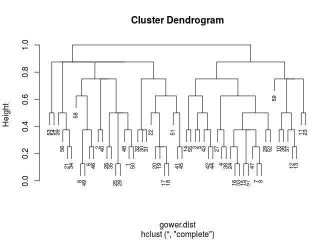


There are two methods allowing establishing evaluation  criteria for the number ofclusters K to adopt: silhouette values and the bootstrap method.

Silhouette Analysis:


```r
ggplot(data = data.frame(t(cstats.table(gower.dist, aggl.clust.c, 10))), 
       aes(x=cluster.number, y=avg.silwidth)) + 
  geom_point(size=1.5)+
  geom_line(size=0.5)+
  scale_x_continuous(breaks = scales::pretty_breaks(n = 10), limits=c(2, 10)) +
  scale_y_continuous(breaks = scales::pretty_breaks(n = 10)) +
  ggtitle("") +
  labs(x = "K", y = "Average silhouette width") +
  theme_minimal(base_size = 15) +
  geom_hline(yintercept=0.18, linetype="dashed", 
                color = "red", size=1)
```

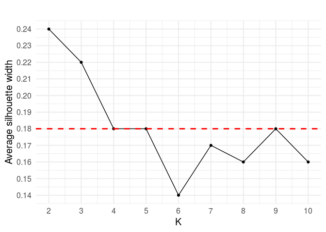


Silhouette Analysis Bootstrap of Clusters and Visualization:

* 2 CLUSTERS:


```r
kchoice<-2
invisible(capture.output(cboot.hclust <- clusterboot(gower.dist,distances=TRUE,clustermethod=hclustCBI, k=kchoice,method="complete",seed="123456789")))
cboot.hclust$bootmean  
```

```
## [1] 0.8423149 0.7770231
```

```r
cboot.hclust$bootbrd 
```

```
## [1] 0 2
```


```r
dendro <- as.dendrogram(aggl.clust.c)
dendro.col <- dendro %>%
 set("branches_k_color", k = 2, value =   c("#2E9FDF","red")) %>% 
  set("branches_lwd", 1) %>%
  set("labels_colors", k = 2, value =   c("#2E9FDF","red")) %>% 
  set("labels_cex", 1)
circlize_dendrogram(dendro.col)
```

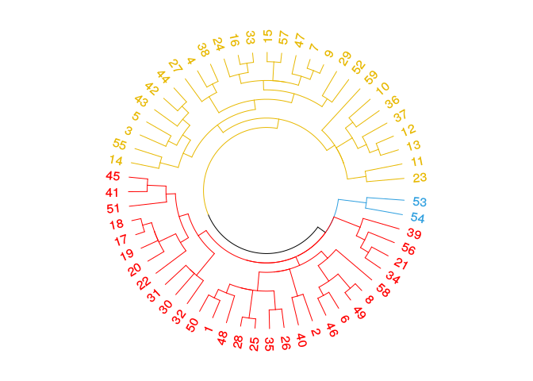

* 3 CLUSTERS:


```r
kchoice<-3
invisible(capture.output(cboot.hclust <- clusterboot(gower.dist,distances=TRUE,clustermethod=hclustCBI, k=kchoice,method="complete",seed="123456789")))
cboot.hclust$bootmean  
```

```
## [1] 0.8269758 0.8038819 0.4952221
```

```r
cboot.hclust$bootbrd 
```

```
## [1]  1  2 57
```


```r
dendro <- as.dendrogram(aggl.clust.c)
dendro.col <- dendro %>%
 set("branches_k_color", k = 3, value =   c("#2E9FDF", "red","#E7B800")) %>% 
set("branches_lwd", 1) %>%
set("labels_colors", k = 3, value =   c("#2E9FDF", "red","#E7B800")) %>% 
set("labels_cex", 1)
circlize_dendrogram(dendro.col)
```


* 4 CLUSTERS:


```r
kchoice<-4
invisible(capture.output(cboot.hclust <- clusterboot(gower.dist,distances=TRUE,clustermethod=hclustCBI, k=kchoice,method="complete",seed="123456789")))
cboot.hclust$bootmean  
```

```
## [1] 0.8441289 0.8300746 0.5662892 0.4727753
```

```r
cboot.hclust$bootbrd 
```

```
## [1]  1  4 49 64
```


```r
dendro <- as.dendrogram(aggl.clust.c)
dendro.col <- dendro %>%
  set("branches_k_color", k = 4, value =   c("#2E9FDF","red","#E7B800","darkgreen")) %>% 
  set("branches_lwd", 1) %>%
  set("labels_colors", k = 4, value =   c("#2E9FDF","red","#E7B800","darkgreen")) %>% 
  set("labels_cex", 1)
circlize_dendrogram(dendro.col)
```

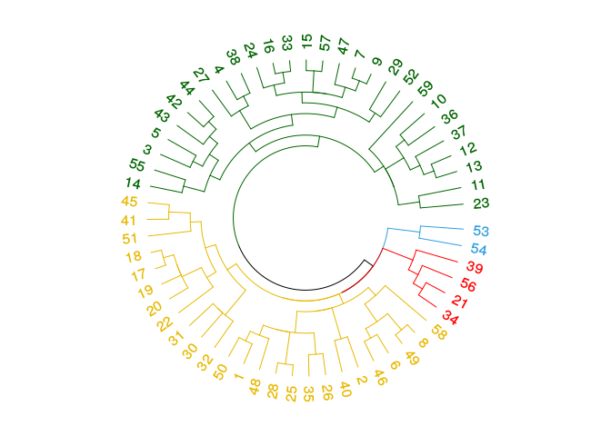

* 9 CLUSTERS:


```r
kchoice<-9
invisible(capture.output(cboot.hclust <- clusterboot(gower.dist,distances=TRUE,clustermethod=hclustCBI, k=kchoice,method="complete",seed="123456789")))
cboot.hclust$bootmean  
```

```
## [1] 0.6946536 0.5451034 0.5109907 0.6680000 0.7800000 0.6060833 0.4335839
## [8] 0.4879693 0.3661667
```

```r
cboot.hclust$bootbrd 
```

```
## [1] 21 53 64 35 28 46 72 67 86
```


```r
dendro <- as.dendrogram(aggl.clust.c)
dendro.col <- dendro %>%
  set("branches_lwd", 1) %>%
  set("labels_colors", k = 9, value=c("#2E9FDF","red","#E7B800","darkgreen", "blue","darkorange","black","gray","purple")) %>% 
  set("labels_cex", 1)
circlize_dendrogram(dendro.col)
```

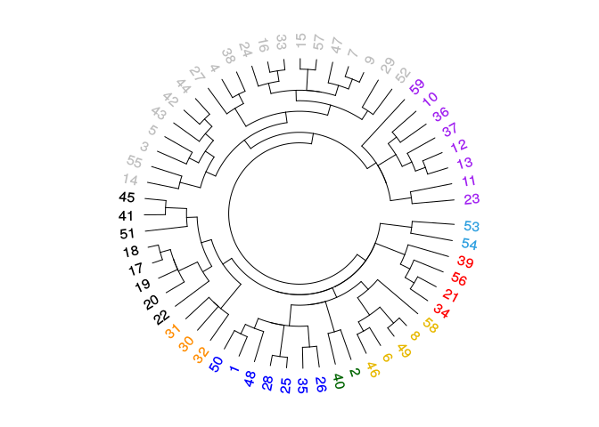

We visualize how the attributes are represented by the clustering


```r
colors_to_use <- as.numeric(xOrig$`Autonomy`)
colors_to_use <- colors_to_use[order.dendrogram(dendro)]
labels_colors(dendro) <- colors_to_use
dendro.list<-as.character(xOrig$`Autonomy`)

circlize_dendrogram(dendro)
```

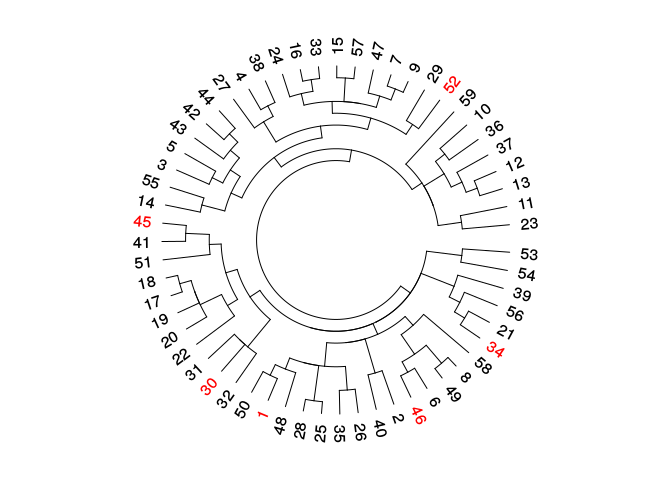


```r
colors_to_use <- as.numeric(x$`Emergent Behaviour`)
colors_to_use <- colors_to_use[order.dendrogram(dendro)]
labels_colors(dendro) <- colors_to_use
dendro.list<-as.character(x$`Emergent Behaviour`)

circlize_dendrogram(dendro)
par(mar=c(0,25,0,0),xpd=TRUE)
legend(-1.7,1, 
       legend = c("No Emergent Behaviour","Emergent Behaviour" ), 
       col = c(1,2), 
       pch = c(20,20), bty = "n",  pt.cex = 1, cex = 0.7,
       text.col = "black", horiz = FALSE)
```

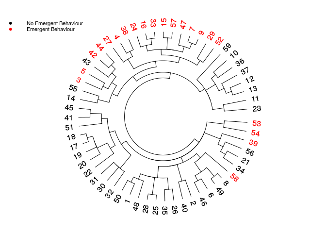


```r
colors_to_use <- as.numeric(x$`Cooperative(agent level)`)
colors_to_use <- colors_to_use[order.dendrogram(dendro)]
labels_colors(dendro) <- colors_to_use
dendro.list<-as.character(x$`Cooperative(agent level)`)

circlize_dendrogram(dendro) 
par(mar=c(0,25,0,0),xpd=TRUE)
legend(-1.7,1, 
       legend = c("Non cooperative agent","Cooperative agent"), 
       col = c(1,2), 
       pch = c(20,20), bty = "n",  pt.cex = 1, cex = 0.7, 
       text.col = "black", horiz = FALSE)
```

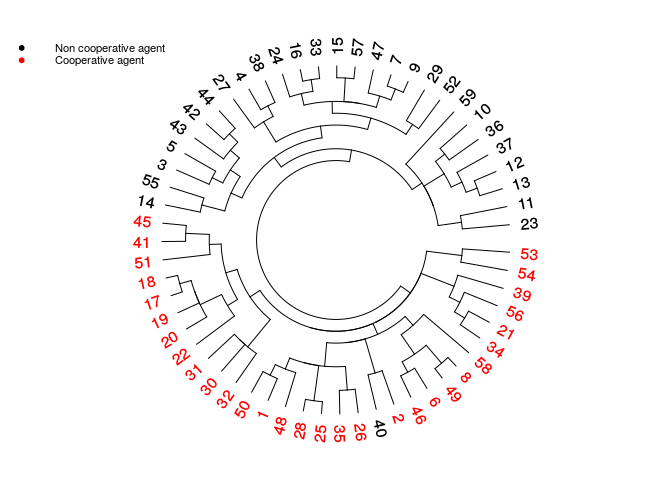


```r
colors_to_use <- as.numeric(x$Behaviour)
colors_to_use <- colors_to_use[order.dendrogram(dendro)]
labels_colors(dendro) <- colors_to_use
dendro.list<-as.character(x$Behaviour)

circlize_dendrogram(dendro)
par(mar=c(0,25,0,0),xpd=NA)
legend(-1.7,1, 
       legend = c("Altruistic" , "Altruistic (collaborative)", "Altruistic locally/Selfish globally","Both versions explored","Selfish","Selfish but collaborative"), 
       col = c(1,2,3,4,5,6), 
       pch = c(20,20,20,20,20,20), bty = "n",  pt.cex = 1, cex = 0.7, 
       text.col = "black", horiz = FALSE)
```


```r
colors_to_use <- as.numeric(x$`Knowledge Access`)
colors_to_use <- colors_to_use[order.dendrogram(dendro)]
labels_colors(dendro) <- colors_to_use
dendro.list<-as.character(x$`Knowledge Access`)

circlize_dendrogram(dendro)
par(mar=c(0,25,0,0),xpd=NA)
legend(-1.7,1, 
       legend = c("Limited","Maximal","Minimal", "Neighborhood", "Tunable"), 
       col = c(1,2,3,4,5,6), 
       pch = c(20,20,20,20,20), bty = "n",  pt.cex = 1, cex = 0.7,
       text.col = "black", horiz = FALSE)
```

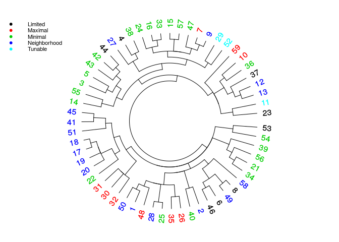


```r
colors_to_use <- as.numeric(x$`Trigger-first`)
colors_to_use <- colors_to_use[order.dendrogram(dendro)]
labels_colors(dendro) <- colors_to_use
dendro.list<-as.character(x$`Trigger-first`)

circlize_dendrogram(dendro)
par(mar=c(0,25,0,0),xpd=NA)
legend(-1.7,1,
       legend = c("Domain knowledge/humans","From peers and other agents","No initial knowledge (random)","Not mentrioned"), 
       col = c(1,2,3,4,5,6), 
       pch = c(20,20,20,20,20), bty = "n",  pt.cex = 1, cex = 0.7,
       text.col = "black", horiz = FALSE)
```

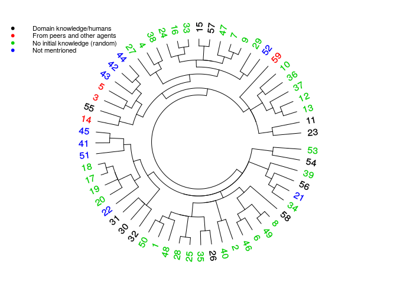


```r
colors_to_use <- as.numeric(x$`Trigger-update`)
colors_to_use <- colors_to_use[order.dendrogram(dendro)]
labels_colors(dendro) <- colors_to_use
dendro.list<-as.character(x$`Trigger-update`)

circlize_dendrogram(dendro)
par(mar=c(0,25,0,0),xpd=NA)
legend(-1.7,1,
       legend = c("Action","Learning task\nthreshold achieved","Not mentioned","Periodic","Social interaction","Task/Episode"), 
       col = c(1,2,3,4,5,6), 
       pch = c(20,20,20,20,20,20), bty = "n",  pt.cex = 1, cex = 0.7,
       text.col = "black", horiz = FALSE)
```

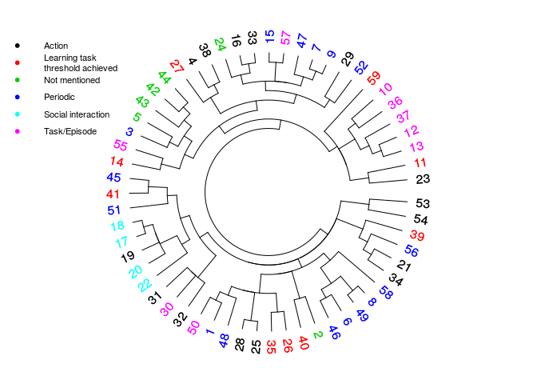


```r
colors_to_use <- as.numeric(x$`Technique`)
colors_to_use <- colors_to_use[order.dendrogram(dendro)]
labels_colors(dendro) <- c(8,6,"#E7B800","#E7B800","#E7B800",8,8,8,8,2,8,8,8,8,8,8,8,"darkgreen",7,"darkgreen","#E7B800",8,3,8,8,8,7,8,4,8,8,8,8,8,"purple","#E7B800",8,8,3,3,3,8,8,8,8,8,7,8,8,8,8,5,1,"purple",8,8,3,"#E7B800",7)
dendro.list<-as.character(x$`Technique`)

circlize_dendrogram(dendro)
par(mar=c(0,25,0,0),xpd=NA)
legend(-1.7,1,
       legend =c("Applied Logic","Evolutionary Process","Game Theory","Game Theory and RL","Genetic Algorithm and RL","Gradient Descent","Probabilistic","Reinforcement Learning","Statistics","Supervised Learning","Swarm System"), 
       col = c(1,2,3,4,5,6,7,8,"purple","#E7B800","darkgreen"), 
       pch = c(20,20,20,20,20,20,20,20,20,20,20), bty = "n",  pt.cex = 1, cex = 0.7,
       text.col = "black", horiz = FALSE)
```

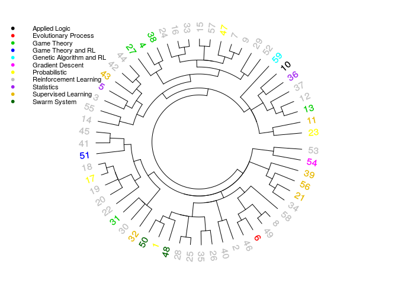


```r
colors_to_use <- as.numeric(x$`Application Domain`)
colors_to_use <- colors_to_use[order.dendrogram(dendro)]
labels_colors(dend) <- colors_to_use
dendro.list<-as.character(x$`Application Domain`)

circlize_dendrogram(dendro)
par(mar=c(0,25,0,0),xpd=NA)
legend(-1.7,1,
       legend = c("Cooperative Game","CPS","Distributed Task\nAllocation Problem","Market","Network","Other","Traffic"),
       col = c(1,2,3,4,5,6,7), 
       pch = c(20,20,20,20,20,20,20), bty = "n",  pt.cex = 1, cex = 0.7,
       text.col = "black", horiz = FALSE)
```

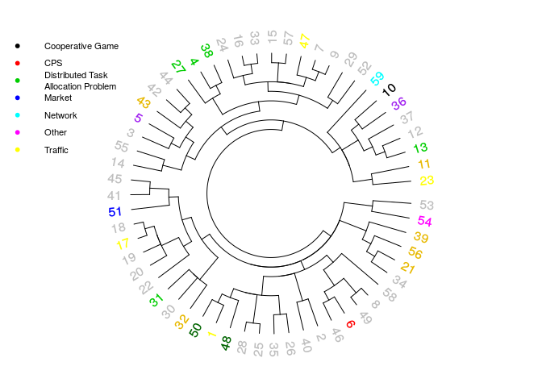

# Multiple Correspondence Analysis

MCA identifies new latent dimensions, which are a combination of the original dimensions and hence can explain information not directly observable. We perform MCA to capture interaction between attributes with the aim of validating and further extending the cluster analysis.

MCA derives for each identified dimension: (i) the relative eigenvalue and, (ii) the identified proportion of variance retained (i.e., the amount of variation accounted for by the corresponding principal dimension).

We report the results obtained with the optimistic Benzcri correction


```r
# Benzcri + Greenacre adjustment	
mca.res.bg <- epMCA(x, graphs = FALSE, correction = c("b","g"))
eig.val <- get_eigenvalue(res.mca)
kable(eig.val) %>%
  kable_styling(full_width = F, font_size = 10, bootstrap_options = c("striped", "hover", "condensed"))
```

<table class="table table-striped table-hover table-condensed" style="font-size: 10px; width: auto !important; margin-left: auto; margin-right: auto;">
 <thead>
  <tr>
   <th style="text-align:left;">   </th>
   <th style="text-align:right;"> eigenvalue </th>
   <th style="text-align:right;"> variance.percent </th>
   <th style="text-align:right;"> cumulative.variance.percent </th>
  </tr>
 </thead>
<tbody>
  <tr>
   <td style="text-align:left;"> Dim.1 </td>
   <td style="text-align:right;"> 0.1016633 </td>
   <td style="text-align:right;"> 32.0966572 </td>
   <td style="text-align:right;"> 32.09666 </td>
  </tr>
  <tr>
   <td style="text-align:left;"> Dim.2 </td>
   <td style="text-align:right;"> 0.0477599 </td>
   <td style="text-align:right;"> 15.0785324 </td>
   <td style="text-align:right;"> 47.17519 </td>
  </tr>
  <tr>
   <td style="text-align:left;"> Dim.3 </td>
   <td style="text-align:right;"> 0.0435705 </td>
   <td style="text-align:right;"> 13.7558631 </td>
   <td style="text-align:right;"> 60.93105 </td>
  </tr>
  <tr>
   <td style="text-align:left;"> Dim.4 </td>
   <td style="text-align:right;"> 0.0302412 </td>
   <td style="text-align:right;"> 9.5476127 </td>
   <td style="text-align:right;"> 70.47867 </td>
  </tr>
  <tr>
   <td style="text-align:left;"> Dim.5 </td>
   <td style="text-align:right;"> 0.0237786 </td>
   <td style="text-align:right;"> 7.5072644 </td>
   <td style="text-align:right;"> 77.98593 </td>
  </tr>
  <tr>
   <td style="text-align:left;"> Dim.6 </td>
   <td style="text-align:right;"> 0.0213798 </td>
   <td style="text-align:right;"> 6.7499243 </td>
   <td style="text-align:right;"> 84.73585 </td>
  </tr>
  <tr>
   <td style="text-align:left;"> Dim.7 </td>
   <td style="text-align:right;"> 0.0131710 </td>
   <td style="text-align:right;"> 4.1583027 </td>
   <td style="text-align:right;"> 88.89416 </td>
  </tr>
  <tr>
   <td style="text-align:left;"> Dim.8 </td>
   <td style="text-align:right;"> 0.0098605 </td>
   <td style="text-align:right;"> 3.1131107 </td>
   <td style="text-align:right;"> 92.00727 </td>
  </tr>
  <tr>
   <td style="text-align:left;"> Dim.9 </td>
   <td style="text-align:right;"> 0.0082914 </td>
   <td style="text-align:right;"> 2.6177197 </td>
   <td style="text-align:right;"> 94.62499 </td>
  </tr>
  <tr>
   <td style="text-align:left;"> Dim.10 </td>
   <td style="text-align:right;"> 0.0073535 </td>
   <td style="text-align:right;"> 2.3216133 </td>
   <td style="text-align:right;"> 96.94660 </td>
  </tr>
  <tr>
   <td style="text-align:left;"> Dim.11 </td>
   <td style="text-align:right;"> 0.0043133 </td>
   <td style="text-align:right;"> 1.3617619 </td>
   <td style="text-align:right;"> 98.30836 </td>
  </tr>
  <tr>
   <td style="text-align:left;"> Dim.12 </td>
   <td style="text-align:right;"> 0.0036845 </td>
   <td style="text-align:right;"> 1.1632455 </td>
   <td style="text-align:right;"> 99.47161 </td>
  </tr>
  <tr>
   <td style="text-align:left;"> Dim.13 </td>
   <td style="text-align:right;"> 0.0009755 </td>
   <td style="text-align:right;"> 0.3079905 </td>
   <td style="text-align:right;"> 99.77960 </td>
  </tr>
  <tr>
   <td style="text-align:left;"> Dim.14 </td>
   <td style="text-align:right;"> 0.0006243 </td>
   <td style="text-align:right;"> 0.1970954 </td>
   <td style="text-align:right;"> 99.97669 </td>
  </tr>
  <tr>
   <td style="text-align:left;"> Dim.15 </td>
   <td style="text-align:right;"> 0.0000738 </td>
   <td style="text-align:right;"> 0.0233061 </td>
   <td style="text-align:right;"> 100.00000 </td>
  </tr>
</tbody>
</table>

To interpret the results of MCA it is necessary to choose the number of dimensions to retain. We decided, according to the average rule introduced by Lorenzo-Seva et. al.~\cite{Lorenzo-Seva:2011}, to keep all the dimensions whose variance is greater than 9%. Hence, we keep 4 dimensions.


Contributions of the attributes to PC1 (principal component one)


```r
fviz_contrib(res.mca, choice="var", axes = 1, top =15,
             fill = "lightgray", color = "black") +
  theme_minimal() +
  labs(title = "", x = "") +
  theme(text = element_text(size=10), axis.text.x = element_text(angle=70, vjust=1, hjust=1))
```

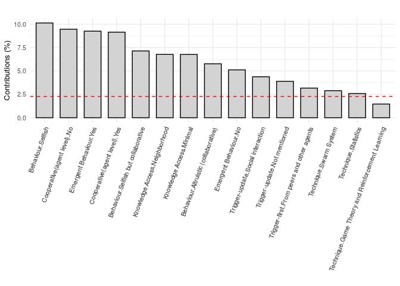

Contributions of the attributes to PC2


```r
fviz_contrib(res.mca, choice="var", axes = 2, top =15,
             fill = "lightgray", color = "black") +
  theme_minimal() +
  labs(title = "", x = "") +
  theme(text = element_text(size=10), axis.text.x = element_text(angle=77, vjust=1, hjust=1))
```

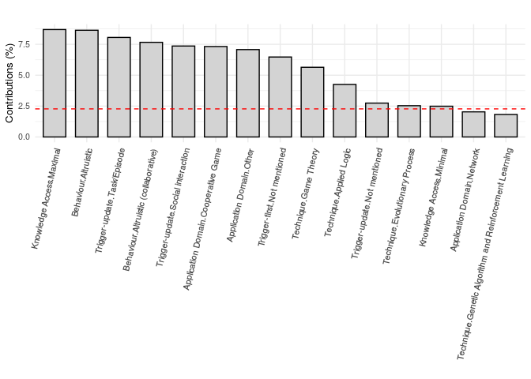


Contributions of the attributes to PC3


```r
fviz_contrib(res.mca, choice="var", axes = 3, top =15,
             fill = "lightgray", color = "black") +
  theme_minimal() +
  labs(title = "", x = "") +
  theme(text = element_text(size=10), axis.text.x = element_text(angle=77, vjust=1, hjust=1))
```

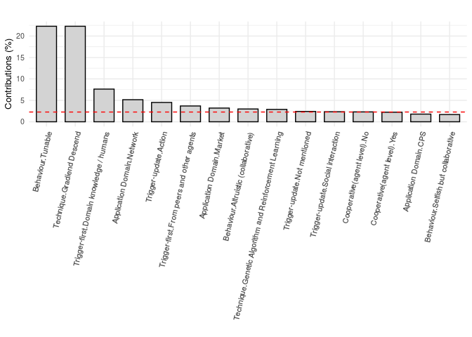

Contributions of the attributes to PC4


```r
fviz_contrib(res.mca, choice="var", axes = 4, top =15,
             fill = "lightgray", color = "black") +
  theme_minimal() +
  labs(title = "", x = "") +
  theme(text = element_text(size=10), axis.text.x = element_text(angle=77, vjust=1, hjust=1))
```

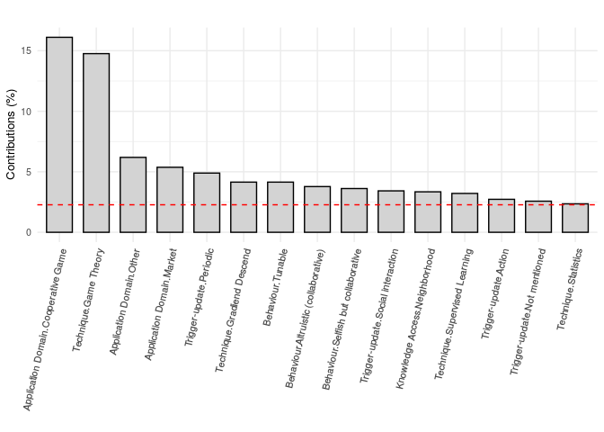

We show the biplots:


```r
fviz_mca_ind(res.mca,
             legend.title = "Emergent Behaviour",
             pointsize = 1.2,
             labelsize = 3,
             habillage = x$`Emergent Behaviour`,
             palette = c("#FC4E07","#00AFBB", "#E7B800", "#FC4E07"),
             addEllipses = TRUE, 
             ellipse.level = 0.95,
             axes = c(1, 2)
             ) + labs(title = "", x = "Dim.1", y ="Dim.2")
```

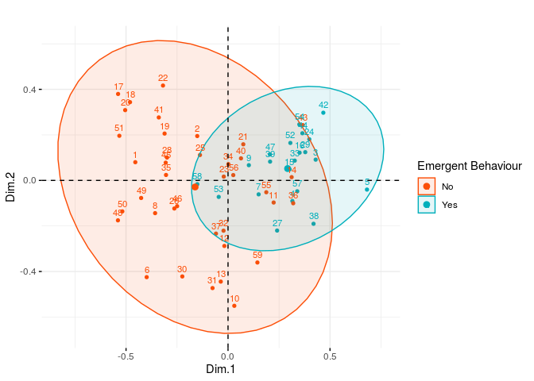


```r
fviz_mca_ind(res.mca,
             legend.title = "Cooperative (agent level)",
             pointsize = 1.2,
             labelsize = 3,
             habillage = data$`Cooperative (agent level)`, 
             palette = c("#FC4E07","#00AFBB", "#E7B800", "#FC4E07"),
             addEllipses = TRUE,
             ellipse.level = 0.95,
             axes = c(1, 2)
) + labs(title = "", x = "Dim.1", y ="Dim.2")
```

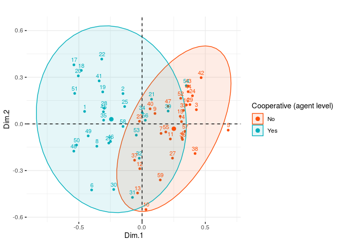


```r
fviz_mca_ind(res.mca,
             legend.title = "Behaviour",
             pointsize = 1.2,
             labelsize = 3,
             habillage = data$`Behaviour`,
             palette = c("#2fc437","#00AFBB","#E7B800","#FC4E07","#e633ff","#FF8000","#8000FF","#0080FF","#FF0080"),
             addEllipses = TRUE, # Concentration ellipses
             ellipse.level = 0.8,
             axes = c(1,2)
) + labs(title = "", x = "Dim.1", y ="Dim.2")
```


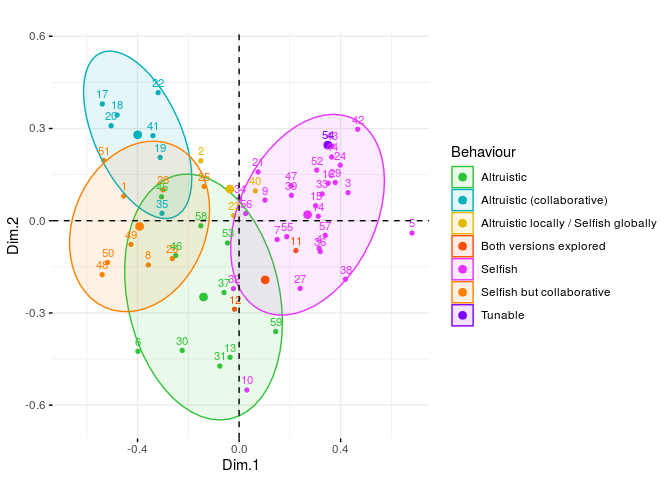


```r
fviz_mca_ind(res.mca,
             legend.title = "Trigger - first",
             pointsize = 1.2,
             labelsize = 3,
             habillage = data$`Trigger - first`,
             palette = c("#2fc437","#00AFBB","#E7B800","#FC4E07","#e633ff","#FF8000","#8000FF","#0080FF","#FF0080"),
             addEllipses = TRUE, # Concentration ellipses
             ellipse.level = 0.6,
             axes = c(2,3),
) + labs(title = "", x = "Dim.2", y ="Dim.3")
```

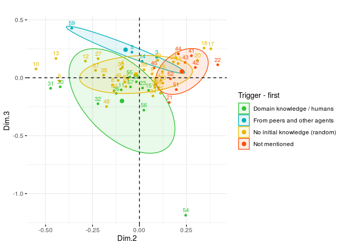


```r
fviz_mca_ind(res.mca,
             legend.title = "Trigger - update",
             pointsize = 1.2,
             labelsize = 3,
             habillage = data$`Trigger - update`, # color by groups
             palette = c("#2fc437","#00AFBB","#E7B800","#FC4E07","#e633ff","#FF8000","#8000FF","#0080FF","#FF0080"),
             addEllipses = TRUE, # Concentration ellipses
             ellipse.level = 0.6,
             axes = c(2,3)
) + labs(title = "", x = "Dim.2", y ="Dim.3")
```

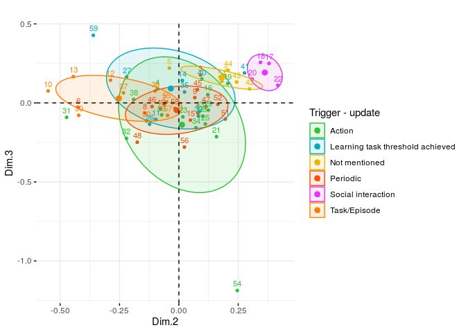


```r
fviz_mca_ind(res.mca,
             legend.title = "Knowledge Access",
             pointsize = 1.2,
             labelsize = 3,
             habillage = data$`Knowledge Access`, 
             palette = c("#2fc437","#00AFBB","#E7B800","#FC4E07","#e633ff","#FF8000","#8000FF","#0080FF","#FF0080"),
             addEllipses = TRUE, # Concentration ellipses
             ellipse.level = 0.6,
             axes = c(2,3)
) + labs(title = "", x = "Dim.2", y ="Dim.3")
```

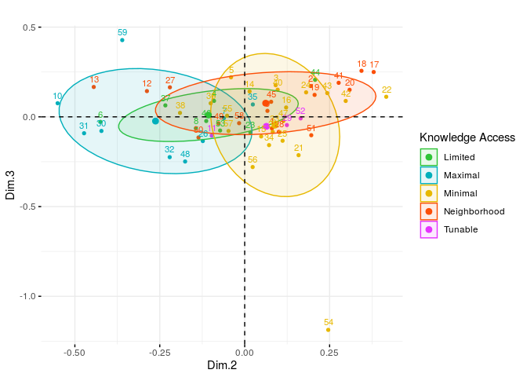


```r
fviz_mca_ind(res.mca,
             legend.title = "Technique",
             pointsize = 1.2,
             labelsize = 3,
             habillage = data$`Technique`,
             addEllipses = TRUE,
             ellipse.level = 0.5,
             axes = c(3,4)
) + labs(title = "", x = "Dim.3", y ="Dim.4")
```


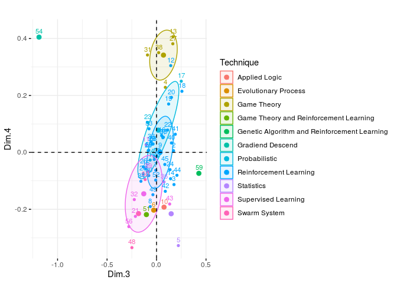


```r
fviz_mca_ind(res.mca,
             legend.title = "Application Domain",
             pointsize = 1.2,
             labelsize = 3,
             habillage = data$`Application Domain`, # color by groups
             addEllipses = TRUE, # Concentration ellipses
             ellipse.level = 0.6,
             axes = c(3,4)
) + labs(title = "", x = "Dim.3", y ="Dim.4") 
```

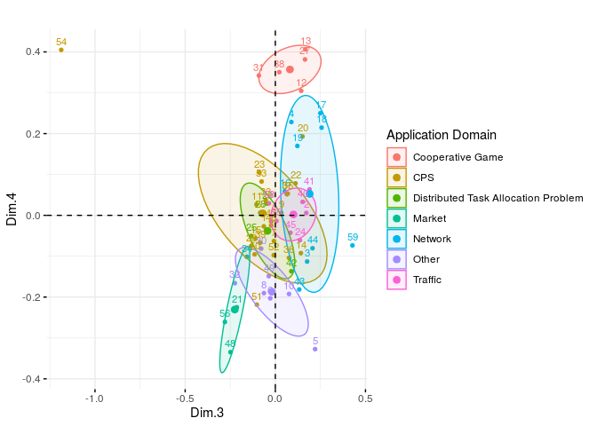
